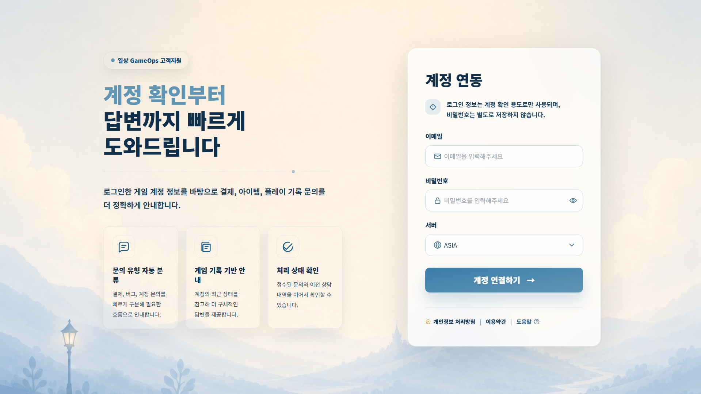
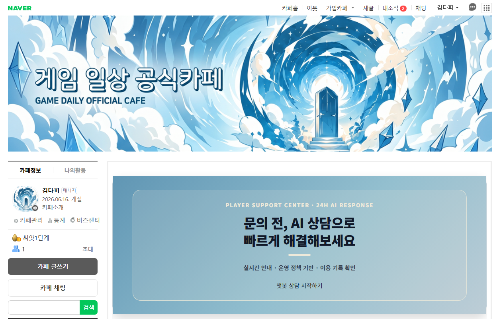
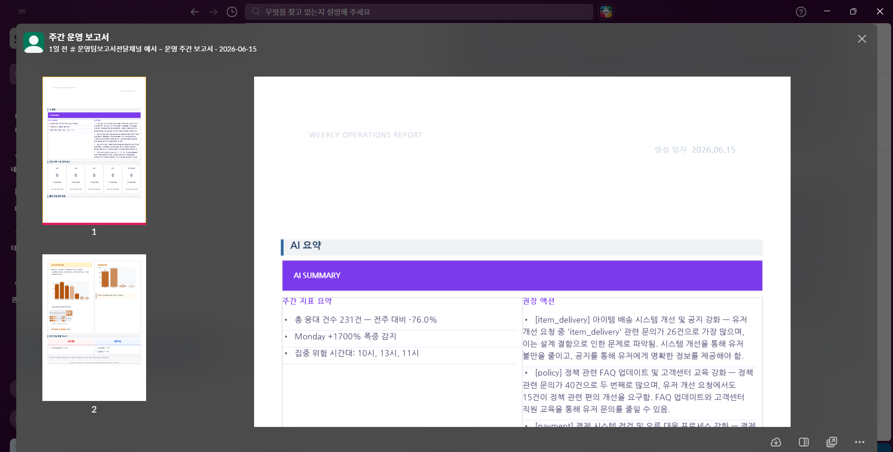
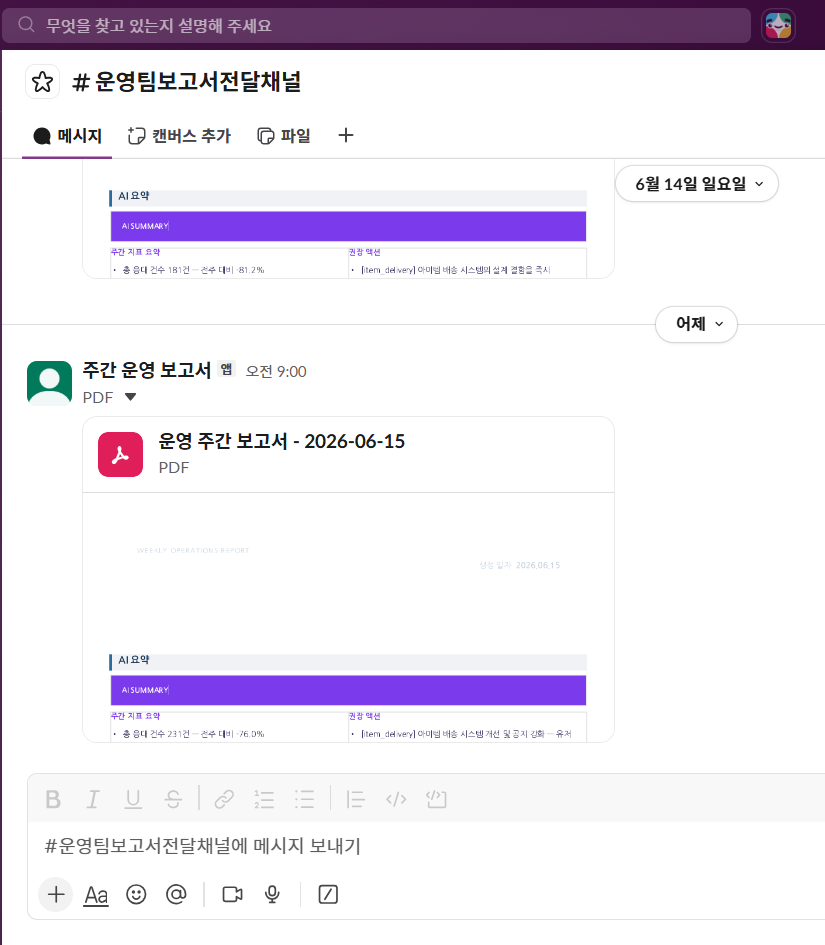
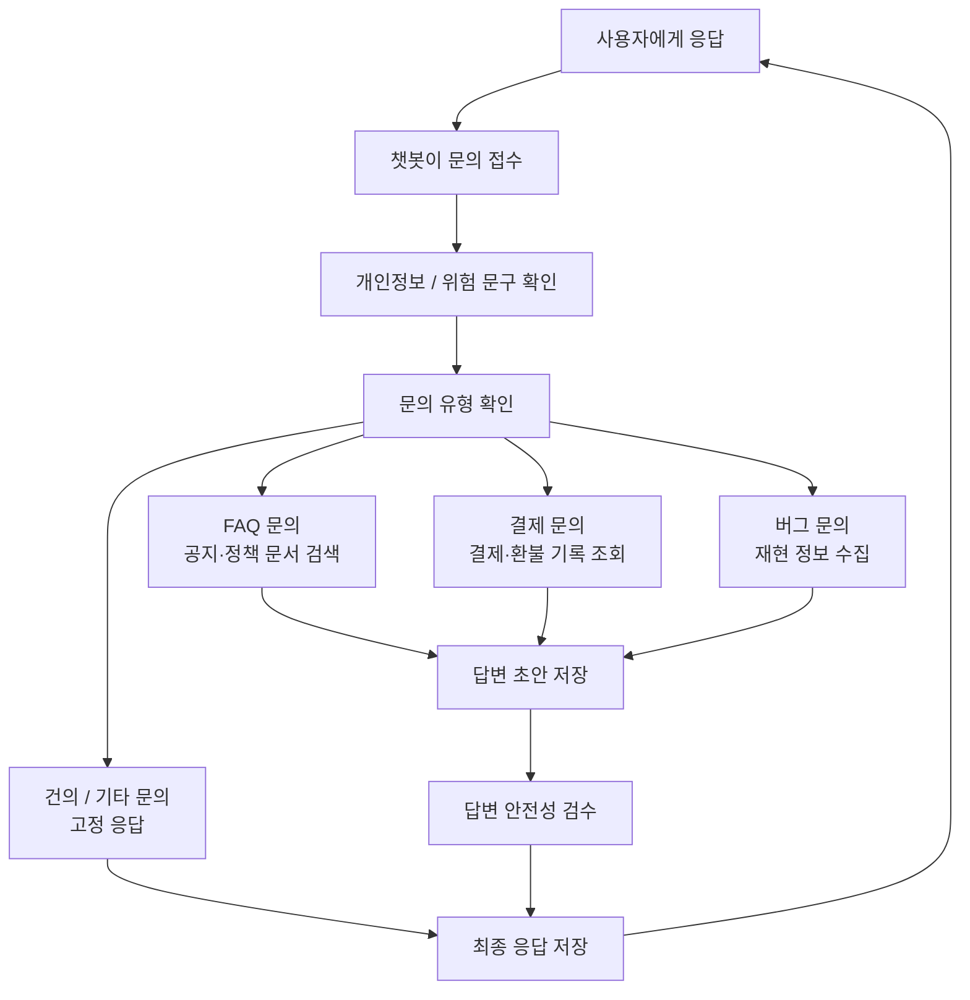
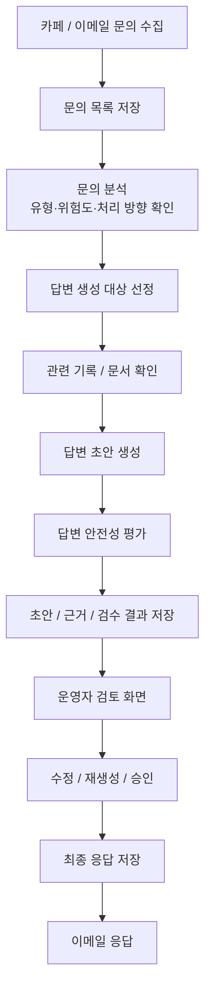
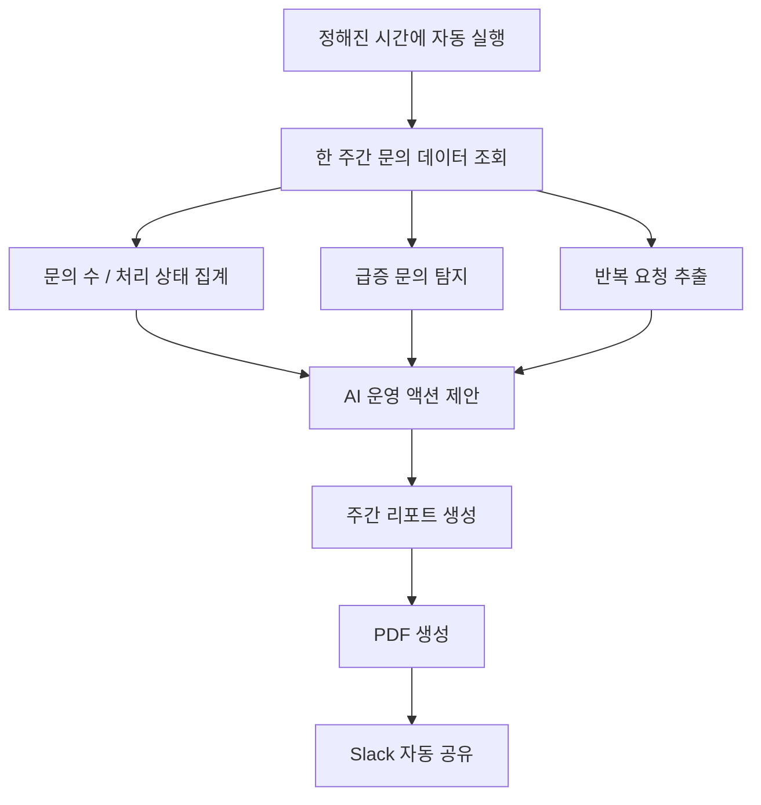

<div align="center">

# GameOps Support Platform

게임 유저 문의 관리 및 맞춤형 응대 자동화 솔루션<br>응대 최적화와 데이터 중심 운영 혁신을 위한 AI 기반 CS 운영 플랫폼
<br>
https://www.youtube.com/watch?v=HQQmrwhDTqo
<br>


<br>
<br>

<table align="center">
  <tr>
    <td align="center"><b>프로젝트</b></td>
    <td>SKN25 FINAL 6Team</td>
  </tr>
  <tr>
    <td align="center"><b>도메인</b></td>
    <td>게임 고객지원 CS 자동화</td>
  </tr>
  <tr>
    <td align="center"><b>핵심 기능</b></td>
    <td>챗봇 · CS 자동화 · 주간 리포트</td>
  </tr>
  <tr>
    <td align="center"><b>주요 기술</b></td>
    <td>FastAPI · LangGraph · PostgreSQL/pgvector · Airflow · Docker</td>
  </tr>
</table>

</div>

<br>

---

<div align="center">

## 목차

</div>

<table align="center">
  <tr>
    <td valign="top" width="50%">

  **프로젝트 이해**
  - [1. 프로젝트 소개](#프로젝트-소개)
  - [2. 문제 정의](#문제-정의)
  - [3. 기대 효과](#기대-효과)
  - [4. 수집 데이터 및 전처리](#수집-데이터-및-전처리)
  - [5. 프로젝트 구조](#프로젝트-구조)
  - [6. 주요 기능](#주요-기능)
  - [7. 화면 예시](#화면-예시)
  - [8. 아키텍처](#아키텍처)

  </td>
  <td valign="top" width="50%">

  **구현 · 실행 · 검증**
  - [9. 주요 API](#주요-api)
  - [10. 데이터베이스](#데이터베이스)
  - [11. 배치 스케줄](#배치-스케줄)
  - [12. 설치 및 실행](#설치-및-실행)
  - [13. 테스트와 평가](#테스트와-평가)
  - [14. 성능 개선 및 운영비](#성능-개선-및-운영비)
  - [15. 개선점 및 향후 계획](#개선점-및-향후-계획)
  - [16. 기술 스택](#기술-스택)
  - [17. 참고 문서](#참고-문서)
  - [18. 팀원](#팀원)

  </td>
  </tr>
</table>

---

## 프로젝트 소개

<br>

**GameOps Support Platform**은 게임사의 CS 업무 전주기를 자동화하는 AI 기반 통합 운영 플랫폼입니다.

결제·버그·FAQ·VOC 문의 접수부터 AI 답변 생성, 운영자 검수·승인, 주간 운영 리포트까지 하나의 파이프라인으로 처리해 CS 팀의 처리 부담을 줄이고 응답 품질의 일관성을 높입니다.

AI가 일반 문의를 자동 처리하고, 위험도가 높은 이슈와 운영 인사이트는 운영자가 검수·활용하는 구조로 설계했습니다. 즉시 응대가 필요한 사용자 문의와 운영자 판단이 필요한 이슈를 분리해, 소규모 운영팀도 대규모 문의 흐름을 안정적으로 관리할 수 있도록 돕습니다.

<br>

<div align="center">

<table>
  <tr>
    <td align="center"><b>고객 문의</b><br><sub>챗봇</sub></td>
    <td align="center">&nbsp;&nbsp;→&nbsp;&nbsp;</td>
    <td align="center"><b>AI 답변 생성</b><br><sub>LangGraph · RAG</sub></td>
    <td align="center">&nbsp;&nbsp;→&nbsp;&nbsp;</td>
    <td align="center"><b>운영자 검수</b><br><sub>CS 자동화</sub></td>
    <td align="center">&nbsp;&nbsp;→&nbsp;&nbsp;</td>
    <td align="center"><b>주간 리포트</b><br><sub>Airflow · Slack</sub></td>
  </tr>
</table>

</div>

<br>

| 서비스 | 내용 |
| :--- | :--- |
| **챗봇** | 사용자 로그인 후 챗봇으로 문의를 접수합니다. 입력 전처리·카테고리 라우팅·DB 조회·RAG 검색·안전성 검사를 거쳐 근거 기반 최종 응답을 자동 생성합니다. |
| **CS 자동화** | 운영자는 Airflow 배치로 생성된 분석 결과와 답변 초안을 검토하고, 필요 시 수정·재생성 후 승인합니다. 승인된 답변은 메일 발송 기능을 통해 전달할 수 있습니다. |
| **주간 운영 리포트** | 매주 월요일 09:00 KST, Airflow가 전주 운영 지표를 자동 집계하고 이상치 탐지·AI 권장 액션이 포함된 PDF 리포트를 Slack 채널로 발송합니다. |

### 타겟 사용자

| 대상 | 필요 |
| :--- | :--- |
| 소규모 인력으로 대규모 문의를 처리해야 하는 게임사 | 반복 문의 처리 자동화와 운영자 검수 흐름 통합 |
| 이벤트·업데이트 시 문의 급증을 겪는 운영팀 | 급증 이슈 탐지, 일관된 답변 품질, 위험 문의 분리 |
| CS 자동화 도입은 원하지만 통합 솔루션이 부족한 회사 | 챗봇, 운영 검수, 주간 리포트를 하나의 운영 흐름으로 연결 |

### 사용자 시나리오

| 사용자 | 시나리오 |
| :--- | :--- |
| 게임 유저 | 계정 오류, 결제, 환불, 아이템 지급 문의를 챗봇에 입력하면 로그인 연동 정보와 DB/문서 검색 결과를 바탕으로 즉시 안내를 받습니다. |
| 게임 운영자 | 출근 후 누적 문의를 확인하고, AI가 생성한 분석 결과와 답변 초안을 검토한 뒤 간단히 수정·재생성·승인합니다. |
| 기획/운영 담당자 | 주간 리포트에서 문의량 변화, 위험 이슈, 반복 개선 요청, AI 권장 액션을 확인해 다음 운영 의사결정에 반영합니다. |

<br>

---

## 문제 정의

게임 CS는 결제, 환불, 아이템 지급, 계정, 버그, FAQ, VOC처럼 문의 유형이 다양하고, 각 문의마다 확인해야 하는 데이터와 정책 근거가 다릅니다. 운영자는 반복 문의를 처리하는 동시에 게임 로그, 문서, 기존 처리 기준을 함께 확인해야 하므로 응답 시간이 길어지고 담당자별 답변 품질이 달라질 수 있습니다.

또한 고객 문의에서 반복적으로 나타나는 불편 사항이나 급증 이슈는 운영·기획 의사결정에 중요한 신호지만, 이를 주간 단위로 정리하고 공유하는 과정은 수작업에 의존하기 쉽습니다.

2024년 49억 달러 규모의 게임 시장은 2032년 309억 달러까지 성장할 것으로 전망되며, 연평균 24.1% 성장에 따라 고객 지원 수요도 함께 증가하고 있습니다. 하지만 CS 인력을 같은 속도로 확충하기는 어렵기 때문에, 단순 문의는 빠르게 자동 처리하고 위험도가 높은 이슈는 운영자가 집중 검수할 수 있는 구조가 필요합니다.

본 프로젝트는 문의 접수, 근거 조회, AI 답변 초안 생성, 운영자 검수, 주간 리포트 전달까지 CS 운영 흐름을 하나의 파이프라인으로 연결해 반복 업무를 줄이고, 근거 기반의 일관된 고객 응대를 지원하는 것을 목표로 합니다.

<br>

---

## 기대 효과

| 기대 효과 | 설명 |
| :--- | :--- |
| **CS 처리 효율 향상** | 반복 문의에 대한 분석과 답변 초안 생성을 자동화해 운영자가 근거 확인과 최종 검수에 집중할 수 있습니다. |
| **답변 품질 일관성 확보** | DB 조회와 RAG 검색을 통해 확인된 근거를 기반으로 답변을 생성하고, 안전성 검증 계층으로 환각·정책 위반·유해 표현 가능성을 검수합니다. |
| **운영 안정성 강화** | 챗봇은 안전성 검수 후 자동 응답하고, CS 자동화는 운영자 승인 단계를 거쳐 최종 발송하는 구조로 자동화 효율과 검수 안정성을 함께 확보합니다. |
| **기획·운영 인사이트 제공** | 주간 문의 지표, 급증 이슈, 개선 요청 Top 5, AI 권장 액션을 리포트로 제공해 반복 문제와 사용자 불편 흐름을 빠르게 파악할 수 있습니다. |
| **업무 흐름 통합** | 챗봇, CS 자동화, 주간 운영 리포트를 연결해 문의 접수부터 리포트 공유까지 분리된 업무를 하나의 운영 흐름으로 관리합니다. |

<br>

---

## 수집 데이터 및 전처리

### 데이터 출처 및 수집 방식

| 데이터 | 출처 | 수집 방식 | 활용 위치 |
| :--- | :--- | :--- | :--- |
| 고객 문의 데이터 | QNA API, 네이버 카페 문의 게시글 | API/URL 기반 수집 후 정규화 | 챗봇 문의 접수, CS 자동화 분석/답변 생성 |
| 정책·FAQ·공지 문서 | 게임 운영 정책, FAQ, 공지, 가이드 문서 | URL 수집 및 HTML 본문 추출 | RAG 기반 근거 검색 |
| 사용자/계정 데이터 | 커뮤니티 사용자, 게임 계정 DB | PostgreSQL 테이블 적재 | 로그인, 계정 식별, 문의 이력 조회 |
| 게임 운영 로그 | 결제, 환불, 아이템 지급, 가챠 로그 DB | 업무 테이블 적재 및 SQL 조회 | 결제/환불/아이템 문의 근거 조회 |
| 분석·답변 결과 | 에이전트 분석 결과, 답변 초안, 안전성 평가 | 서비스 실행 결과 DB 저장 | 운영자 검수, 최종 답변, 주간 리포트 |

수집 문서는 QNA API URL 85건, 네이버 카페 URL 1,114건, 약관/개인정보 문서 2건을 기준으로 구성했습니다. 고객센터 문의 해결과 직접 관련성이 낮은 `성우 공개` 카테고리 문서 99건은 검색 품질 저하를 막기 위해 제외했고, 전처리 후 본문이 비어버린 문서 11건도 제거했습니다.

### 데이터 전처리 파이프라인

```text
원본 문의/문서 데이터
  ↓ HTML 태그, HTML entity, 제로폭 문자 제거
  ↓ 불필요한 공백, 줄바꿈, 게시판 UI 문구 정리
  ↓ 검색 가치가 낮은 문서 카테고리 제거
  ↓ 본문 누락 또는 전처리 후 빈 문서 제거
  ↓ 문서 유형별 정규화 (FAQ / 정책 / 공지 / 가이드)
  ↓ 문서 청킹 및 중복 chunk 제거
  ↓ embedding 생성
  ↓
  ├── PostgreSQL DB 적재 (문서 원문, chunk, embedding metadata)
  └── pgvector 기반 벡터 검색 인덱스 구성
```

게시판에서 반복적으로 포함되는 `목록으로`, `이전 글`, `공유하기`, `댓글`, `조회`, `스크랩` 같은 UI 문구는 검색 의미가 낮아 제거했습니다. 이후 문서 유형에 따라 FAQ는 질문과 답변 단위, 정책 문서는 조항 단위, 공지와 가이드는 소제목과 문단 단위로 분리했습니다.

### 청킹 및 임베딩 설계

| 항목 | 내용 |
| :--- | :--- |
| 저장 테이블 | `documents`, `documents_chunks`, `documents_embeddings` |
| 청킹 기준 | FAQ는 `질문 + 답변`, 정책은 조항, 공지/가이드는 소제목과 문단 기준 |
| 중복 제거 | chunk hash 기준 중복 제거 |
| 최종 임베딩 모델 | `text-embedding-3-small` |
| 벡터 차원 | 1536 |
| 검색 방식 | 사용자 문의를 임베딩한 뒤 pgvector 기반 유사도 검색 |
| 활용 위치 | Chatbot FAQ/공지 Agent, CS Auto 문서 검색 Worker |

벡터화 대상 문장은 답변 생성에 바로 사용할 수 있도록 문서 제목, 카테고리, 본문 핵심 내용을 함께 포함해 구성했습니다.

```text
[FAQ] 결제 후 아이템이 지급되지 않았어요.
결제 완료 후에도 아이템이 지급되지 않은 경우 결제 내역과 계정 정보를 확인한 뒤
지급 로그를 기준으로 재지급 또는 환불 가능 여부를 안내합니다.
```

### 데이터 평가

검색 성능은 30개 평가 질의 기준으로 비교했습니다. 세 모델 모두 정답 문서를 상위 5개 안에 100% 검색했으며, 1순위 정답 문서 비율도 `27/30`으로 동일했습니다.

| 항목 | `small1536` | `large1536` | `large3072` |
| :--- | ---: | ---: | ---: |
| `source_hit@5` | 30 / 30 | 30 / 30 | 30 / 30 |
| `top1_hit` | 27 / 30 | 27 / 30 | 27 / 30 |

품질 평가는 RAGAS, ARES, CRUD-RAG의 RAG 검색/생성 평가 관점을 참고해 `context_precision`, `context_recall`, `faithfulness`를 확인했습니다. `large3072`가 가장 높은 종합 평균을 보였지만, 검색 성능 차이가 크지 않고 비용 효율이 높은 `text-embedding-3-small` 1536차원을 최종 선택했습니다.

| 항목 | `small1536` | `large1536` | `large3072` |
| :--- | ---: | ---: | ---: |
| `context_precision` | 0.8324 | 0.8474 | 0.8419 |
| `context_recall` | 0.8500 | 0.8500 | 0.8667 |
| `faithfulness` | 0.8668 | 0.9043 | 0.9227 |
| 종합 평균 | 0.8497 | 0.8672 | 0.8771 |

| 모델 | 가격 |
| :--- | ---: |
| `text-embedding-3-small` | $0.020 / 1M tokens |
| `text-embedding-3-large` | $0.130 / 1M tokens |

<br>

---

## 프로젝트 구조

```text
SKN25-FINAL-6Team/
├── apps/
│   ├── chatbot/
│   │   ├── backend/
│   │   │   ├── api/                 # 챗봇 FastAPI 엔드포인트
│   │   │   ├── chains/              # LangGraph 워크플로우, 라우팅, 저장 흐름
│   │   │   ├── generation/          # FAQ / 결제 / 버그 / VOC 응답 생성 로직
│   │   │   ├── repository/          # 챗봇 DB 조회 계층
│   │   │   ├── safety/              # 개인정보, 환각, 유해성 등 안전성 검증
│   │   │   ├── service/             # 챗봇 실행 서비스
│   │   │   ├── tools/               # 챗봇에서 사용하는 DB 도구
│   │   │   ├── evals/               # 챗봇 평가 데이터셋 및 평가 스크립트
│   │   │   ├── observability/       # 챗봇 관측성 설정
│   │   │   ├── utils/               # 입력 전처리 등 유틸리티
│   │   │   ├── agent.py             # LangChain Agent 호출부
│   │   │   ├── constants.py         # 챗봇 상수
│   │   │   └── schemas.py           # 챗봇 상태 및 타입 정의
│   │   └── frontend/
│   │       └── static/              # 챗봇 정적 프론트엔드
│   │
│   ├── cs_auto/
│   │   ├── backend/
│   │   │   ├── agents/              # 문의 분석, 답변 초안 생성, DB/문서 검색 도구
│   │   │   ├── api/                 # 운영자 검토 화면용 API
│   │   │   ├── airflow/             # 분석/답변 생성 배치 DAG
│   │   │   ├── evals/               # CS 자동화 평가 데이터셋 생성 도구
│   │   │   ├── observability/       # CS 자동화 관측성 설정
│   │   │   └── utils/               # 로그인, 이메일 발송 유틸리티
│   │   ├── frontend/                # 운영자 검토 화면
│   │   └── deploy/                  # CS 자동화 배포 스크립트 및 Dockerfile
│   │
│   ├── weekly_report/
│   │   ├── ai/                      # AI 운영 액션 생성
│   │   ├── airflow/                 # 주간 리포트 Airflow DAG
│   │   ├── api/                     # 주간 리포트 수동 실행 API
│   │   ├── build/                   # 리포트 데이터 조립
│   │   ├── db/                      # 리포트용 DB 조회 쿼리
│   │   ├── observability/           # 주간 리포트 관측성 설정
│   │   ├── output/                  # PDF 생성 및 Slack 전송
│   │   ├── utils/                   # 날짜, 라벨, 통계 유틸리티
│   │   └── report.py                # 주간 리포트 파이프라인 진입점
│   │
│   └── tests/                       # 챗봇, CS 자동화, 주간 리포트 테스트
│
├── common/
│   ├── db/                          # 공통 DB 연결
│   ├── documents_processing/         # 문서 정규화, 청킹, 임베딩 처리
│   ├── drafting/                    # 공통 답변 생성 보조 로직
│   ├── llm/                         # LLM 클라이언트 래퍼
│   ├── observability/               # 공통 Langfuse / 로깅 설정
│   └── retrieval/                   # 임베딩, 벡터 검색, 재정렬, 검색 캐시
│
├── data/
│   ├── keywords/                    # 분류, 위험도, 감성, 라우팅 키워드
│   ├── prompts/                     # 챗봇 / CS 자동화 프롬프트
│   ├── raw/                         # 원천 데이터
│   ├── sql/                         # 고정 SQL 템플릿
│   └── tests/                       # 평가용 데이터
│
├── deploy/
│   ├── nginx/                       # Nginx 설정 및 Dockerfile
│   ├── docker-compose.chatbot.yml   # 챗봇 배포 구성
│   ├── docker-compose.cs-auto.yml   # CS 자동화 배포 구성
│   ├── docker-compose.airflow.yml   # Airflow 배포 구성
│   └── .env.example                 # 배포 환경변수 예시
│
├── docs/
│   ├── DB/                          # DB 스키마 및 테이블 설명
│   ├── chatbot/                     # 챗봇 설계 및 리팩터링 문서
│   ├── cs_auto/                     # CS 자동화 설계 및 평가 문서
│   ├── weekly_report/               # 주간 리포트 요구사항 및 아키텍처
│   ├── data_generation/             # 데이터 생성 및 전처리 문서
│   └── test_strategy.md             # 테스트 전략
│
├── assets/
│   ├── erd/                         # ERD 이미지
│   └── frontend/                    # 화면 예시 이미지
│
├── requirements.txt                 # 공통 Python 의존성
└── README.md
```

<br>

---

## 주요 기능

<br>

<table width="100%">
  <thead>
    <tr>
      <th width="33%">챗봇</th>
      <th width="33%">CS 자동화</th>
      <th width="33%">주간 운영 리포트</th>
    </tr>
  </thead>
  <tbody>
    <tr>
      <td valign="top">
        <b>사용자 문의 접수 및 자동 응답</b><br><br>
        - 사용자 로그인 및 문의 이력 조회<br>
        - 결제 / 버그 / FAQ / VOC 문의 유형별 응답 처리<br>
        - LangGraph 기반 다단계 워크플로우<br>
        - 개인정보 마스킹 및 프롬프트 인젝션 탐지<br>
        - DB 조회와 RAG 검색 기반 답변 생성<br>
        - 안전성 검증 계층 기반 최종 응답 검증
      </td>
      <td valign="top">
        <b>운영자 검수 및 답변 승인</b><br><br>
        - 검토 대상 티켓 목록 및 상세 조회<br>
        - AI 분석 결과, 초안, 근거 문서 확인<br>
        - 답변 초안 수정 / 재생성 / 승인<br>
        - 승인 답변 고객 메일 발송<br>
        - 새벽 시간대 에이전트 배치 처리<br>
        - 고정 SQL / 동적 SQL 조회 전략 분리
      </td>
      <td valign="top">
        <b>기획팀용 주간 운영 리포트</b><br><br>
        - 매주 월요일 09:00 KST 자동 생성<br>
        - 문의량, 처리 상태, 카테고리 분포 집계<br>
        - 전주 대비 증감 및 이상치 탐지<br>
        - 유저 개선 요청 Top 5 산출<br>
        - AI 권장 액션 생성<br>
        - PDF 렌더링 후 Slack 전송
      </td>
    </tr>
  </tbody>
</table>

<br>

---

## 화면 예시

<table width="100%">
  <tr>
    <td align="center" width="50%">
      <b>챗봇</b><br><br>
      
    </td>
    <td align="center" width="50%">
      <b>CS 자동화</b><br><br>
      
    </td>
  </tr>
  <tr>
    <td align="center" width="50%">
      <b>주간 운영 리포트</b><br><br>
      
    </td>
    <td align="center" width="50%">
      <b>Slack 리포트</b><br><br>
      
    </td>
  </tr>
</table>

<br>

---

## 아키텍처

### 챗봇 아키텍처


### CS 자동화 아키텍처


### 주간 운영 리포트 아키텍처



### CS 자동화 아키텍처

CS 자동화는 분석 에이전트와 답변 초안 작성 에이전트를 분리해 처리합니다. 분석 에이전트는 미분석 문의를 읽고 카테고리, 감성, 위험도, 필요한 근거 자료 종류를 먼저 결정합니다. 답변 초안 작성 에이전트는 분석 결과를 바탕으로 DB 또는 문서 근거를 수집하고, 고객 답변 초안과 안전성 결과를 생성합니다.

| 단계 | 역할 | 주요 처리 |
| :--- | :--- | :--- |
| 문의 분석 에이전트 | 미분석 문의 분석 | 카테고리, 감성, 위험도, 근거 자료 종류 결정 |
| 답변 초안 작성 에이전트 | 근거 기반 답변 생성 | DB/문서 근거 수집, 초안 작성, 안전성 검사 |
| 문서 검색 담당자 | 문서 근거 검색 | 공지, FAQ, 정책, 가이드 문서를 검색해 답변 생성에 필요한 근거 전달 |
| 답변 초안 작성 담당자 | 근거 기반 답변 제한 | 수집된 근거만 사용하도록 프롬프트와 생성 흐름을 제한해 임의 답변 방지 |
| 답변 안전성 검수 담당자 | 안전성 점수 판단 | 기준 미달 시 고정 답변 템플릿으로 전환 |

문의 분석 배치는 문의량이 가장 낮은 04~05시를 기준으로 실행합니다. 해당 시간대에 하루치 문의 데이터를 DB에서 조회해 에이전트가 처리하고, 실시간 응대와 분석/답변 초안 생성 흐름이 서로 영향을 주지 않도록 분리했습니다.

안전성 기준 미달 시에는 고정 답변으로 전환합니다. 종합 안전성 점수는 아래 기준으로 계산하며, `0.7` 이하일 경우 고정 답변 템플릿을 사용합니다.

```text
종합 안전성 점수 = ((1 - 환각 점수) + (1 - 유해성 점수) + (1 - 정책위반 점수) + 사실성 점수) / 4
```

차단 또는 전환 대상:

- 환각 가능성이 높은 답변
- 유해 표현이 포함된 답변
- 정책 위반 가능성이 있는 답변
- 사실성 부족 답변

### DB 조회 전략

CS 자동화의 DB 조회는 문의 유형에 따라 고정 SQL과 동적 SQL을 분리해 사용합니다. 반복 문의는 사전 정의된 SQL 템플릿으로 빠르게 조회하고, 복합 문의는 필요한 조건을 분석해 안전한 SQL로 변환해 실행합니다.

| 담당 모듈 | 역할 | 설명 |
| :--- | :--- | :--- |
| DB 조회 전략 결정 담당자 | 조회 방식 결정 | 문의 유형을 분석해 고정 SQL과 동적 SQL 중 적절한 조회 방식을 선택 |
| 고정 SQL 조회 담당자 | 반복 문의 빠른 조회 | 결제, 환불, 지급 내역 등 반복 문의를 사전 정의된 SQL 템플릿으로 조회 |
| 동적 SQL 조회 담당자 | 복합 문의 조회 | 복합 문의의 필요한 조건을 분석해 조회 계획을 만들고 안전한 SQL로 변환 |

이 구조를 통해 문의 유형별 SQL 조회 전략을 분리하고, 리소스 사용을 최적화하면서 응답 안정성을 확보했습니다.

<br>

### 주간 운영 리포트 구성

주간 운영 리포트는 기획팀과 운영자가 같은 지표를 기준으로 문제 흐름을 확인할 수 있도록 구성했습니다.

| 구성 요소 | 내용 |
| --- | --- |
| 타이틀 | 생성 날짜, 분석 단위 기간 |
| AI 요약 | 주간 지표 요약, AI 제안 권장 액션 |
| 주간 지표 | 결제, 지급, 아이템, 계정, 인게임버그 블록별 전주 대비 증감 표 |
| 급증/위험 문의 현황 | 전주 대비 폭증 문의, 일별 문의량, 시간별 문의량, 월별 폭증 문의, 주차별 문의량 요약 |
| 유저 개선 요청 Top 5 | 설계 결함, 편의 개선 중심의 개선 후보 |
| 목적 | 기획팀 전달, 가볍고 간결하게 참조 가능한 운영/마케팅 지표 제공 |

<br>

---

## 주요 API

### 챗봇 API

| Method | Endpoint | 설명 |
| :--- | :--- | :--- |
| GET | `/health` | API 상태 확인 |
| GET | `/server-regions` | 서버/지역 목록 조회 |
| POST | `/login` | 사용자 로그인 |
| GET | `/tickets` | 사용자 문의 이력 조회 |
| POST | `/chat` | 챗봇 대화 요청 |

### CS 자동화 API

| Method | Endpoint | 설명 |
| :--- | :--- | :--- |
| GET | `/api/cs-auto/health` | API 상태 확인 |
| GET | `/api/cs-auto/tickets` | 검토 대상 티켓 목록 조회 |
| GET | `/api/cs-auto/tickets/{ticket_id}` | 티켓 상세 조회 |
| POST | `/api/cs-auto/auth/login` | 운영자 로그인 |
| POST | `/api/cs-auto/auth/logout` | 운영자 로그아웃 |
| PATCH | `/api/cs-auto/tickets/{ticket_id}/draft` | 답변 초안 수정 |
| POST | `/api/cs-auto/tickets/{ticket_id}/draft/regenerate` | 답변 초안 재생성 |
| POST | `/api/cs-auto/tickets/{ticket_id}/draft/approve` | 답변 초안 승인 |
| POST | `/api/cs-auto/tickets/{ticket_id}/send-email` | 고객 답변 메일 발송 |

### 주간 운영 리포트 API

| Method | Endpoint | 설명 |
| :--- | :--- | :--- |
| GET | `/health` | API 상태 확인 |
| POST | `/report/trigger` | 주간 리포트 수동 생성 |

<br>

---

## 데이터베이스

라이브 DB 기준 요약은 [docs/DB/db_info.md](./docs/DB/db_info.md), 상세 스키마는 [docs/DB/descriptions.md](./docs/DB/descriptions.md)를 참고합니다.

| 영역 | 주요 테이블 | 설명 |
| :--- | :--- | :--- |
| 문의 | `qa_ticket` | 사용자 문의 원문, 상태, 접수 시각 |
| 사용자/계정 | `community_users`, `game_accounts` | 커뮤니티 사용자와 게임 계정 정보 |
| 분석 | `ticket_analysis` | 카테고리, 감성, 위험도, 라우팅 결과 |
| 답변 | `answer_draft`, `final_response` | AI 초안 및 최종 승인 답변 |
| 근거 | `evidence_docs` | 답변 생성에 사용된 근거 |
| 문서 RAG | `documents`, `documents_chunks`, `documents_embeddings` | 문서 원문, 청크, 임베딩 |
| 안전성 | `safety_results` | 환각, 유해성, 정책 위반, 사실성 점수 |
| 운영 로그 | `admin_event_logs`, `failed_queries`, `notification_logs` | 운영 이벤트, 실패 쿼리, 알림 이력 |
| 업무 로그 | `payments`, `refunds`, `item_delivery_logs`, `gacha_logs` | 결제, 환불, 지급, 가챠 관련 근거 |
| 인사이트 | `insight` | 반복 이슈와 패턴 위험도 |

<br>

---

## 배치 스케줄

| DAG ID | 스케줄 | 설명 |
| :--- | :--- | :--- |
| `cs_auto_analysis_agent_daily` | 매일 04:00 KST | 신규 문의 분석 및 `ticket_analysis` 저장 |
| `cs_auto_answer_agent_daily` | 매일 07:00 KST | 분석 결과 기반 답변 초안 생성 |
| `dashboard_weekly_report` | 매주 월요일 09:00 KST | 주간 리포트 PDF 생성 및 Slack 발송 |

<br>

---

## 설치 및 실행

### 사전 요구사항

- Python 3.12+
- PostgreSQL 16+ 및 pgvector
- Docker / Docker Compose
- LLM API Key
- Slack Bot Token 
- SMTP App Password

### 환경 변수

```powershell
cd deploy
Copy-Item .env.example .env
```

최소 필수 값:

```env
DB_HOST=
DB_PORT=5432
DB_USER=game_cs_user
DB_PASSWORD=
DB_NAME=game_cs

LLM_API_KEY=
LLM_MODEL=
```

주요 선택 값:

```env
CHATBOT_CORS_ORIGINS=http://localhost,http://127.0.0.1
CHATBOT_LANGFUSE_ENABLED=
CHATBOT_LANGFUSE_PUBLIC_KEY=
CHATBOT_LANGFUSE_SECRET_KEY=
CHATBOT_LANGFUSE_HOST=
CHATBOT_LANGFUSE_PROJECT=chatbot
CHATBOT_DEBUG_ROUTING=false

CS_AUTO_API_CORS_ORIGINS=*
CS_AUTO_CORS_ORIGINS=
CS_AUTO_REGENERATION_LIMIT=3
CS_AUTO_ROUTING_MODEL=
SMTP_APP_PASSWORD=
SMTP_HOST=smtp.gmail.com
SMTP_PORT=587
CS_AUTO_LANGFUSE_ENABLED=
CS_AUTO_LANGFUSE_PUBLIC_KEY=
CS_AUTO_LANGFUSE_SECRET_KEY=
CS_AUTO_LANGFUSE_HOST=
CS_AUTO_LANGFUSE_PROJECT=cs-auto

DASHBOARD_WEEKLY_REPORT_CHANNEL=
DASHBOARD_WEEKLY_REPORT_COMMENT=
DASHBOARD_SLACK_BOT_TOKEN=
WEEKLY_REPORT_LANGFUSE_ENABLED=
WEEKLY_REPORT_LANGFUSE_PUBLIC_KEY=
WEEKLY_REPORT_LANGFUSE_SECRET_KEY=
WEEKLY_REPORT_LANGFUSE_HOST=
WEEKLY_REPORT_LANGFUSE_PROJECT=weekly-report
```

전체 예시는 [deploy/.env.example](./deploy/.env.example)에 있습니다.

### 의존성 설치

아래 명령은 `SKN25-FINAL-6Team` 저장소 루트에서 실행하는 기준입니다.

```powershell
python -m venv .venv
.\.venv\Scripts\Activate.ps1
python -m pip install --upgrade pip
python -m pip install -r requirements.txt

python -m pip install -r apps\chatbot\backend\requirements.txt
python -m pip install -r apps\cs_auto\backend\requirements.txt
python -m pip install -r apps\weekly_report\requirements.txt
```

### 로컬 실행

각 백엔드 실행 명령은 `SKN25-FINAL-6Team` 저장소 루트에서 실행하는 기준입니다.

챗봇 백엔드:

```powershell
$env:PYTHONPATH="$PWD;$PWD\apps\chatbot\backend"
python -m uvicorn api.main:app --host 127.0.0.1 --port 8000
```

```text
http://127.0.0.1:8000/health
```

챗봇 프론트엔드:

```powershell
cd apps\chatbot\frontend\static
python -m http.server 5173
```

```text
http://127.0.0.1:5173
```

CS 자동화 백엔드:

```powershell
$env:PYTHONPATH="$PWD;$PWD\apps\cs_auto\backend"
python -m uvicorn api.main:app --host 127.0.0.1 --port 8001
```

```text
http://127.0.0.1:8001/api/cs-auto/health
```

CS 자동화 프론트엔드:

```powershell
cd apps\cs_auto\frontend
python -m http.server 5174
```

```text
http://127.0.0.1:5174/cs_automation.html
```

주간 운영 리포트 API:

```powershell
$env:PYTHONPATH="$PWD;$PWD\apps\weekly_report"
python -m uvicorn api.main:app --host 127.0.0.1 --port 8002
```

```text
http://127.0.0.1:8002/health
```

수동 리포트 생성:

```powershell
Invoke-WebRequest -Method POST http://127.0.0.1:8002/report/trigger
```

### Docker 실행

```powershell
cd deploy
Copy-Item .env.example .env

docker compose --env-file .env -f docker-compose.chatbot.yml up -d --build
docker compose --env-file .env -f docker-compose.cs-auto.yml up -d --build
docker compose --env-file .env -f docker-compose.airflow.yml up -d --build
```

중지:

```powershell
docker compose -f docker-compose.chatbot.yml down
docker compose -f docker-compose.cs-auto.yml down
docker compose -f docker-compose.airflow.yml down
```

### 문서 처리 CLI

```powershell
$env:PYTHONPATH="$PWD"
python -m common.documents_processing.cli --source-type faq --limit 10
python -m common.documents_processing.cli --dry-run --log-level DEBUG
```

<br>

---

## 테스트와 평가

### 테스트 실행

```powershell
pytest
pytest apps\tests\chatbot_tests
pytest apps\tests\cs-auto_tests
pytest apps\tests\weekly_report_tests
pytest common\tests
```

일부 통합 테스트는 실제 DB, LLM, Slack, SMTP 환경 변수를 필요로 합니다.

### 챗봇 평가 요약

챗봇 평가는 실제 워크플로우 처리 정확도를 중심으로 구성했습니다. 입력 전처리, 에이전트별 작업 선택, 근거 문서 탐색, 답변 근거 충실도, Safety 검수 통과 여부, 챗봇 워크플로우(전체 처리 성공률)를 분리해 측정했습니다.

#### 실험 데이터셋

| 평가 영역 | 건수 | 결과 |
| :--- | ---: | :--- |
| 입력 전처리 / 안전성 검사 대상 탐지 | 20건 | 100% |
| FAQ 에이전트 | 40건 | 90% |
| 결제 에이전트 | 30건 | 100% |
| 버그 에이전트 | 20건 | 100% |
| 챗봇 워크플로우(전체 처리 성공률) | 22건 | 95.45% |
| **총합** | **132건** | - |

#### 운영 품질 지표

| 평가 영역 | 주요 지표 | 결과 |
| :--- | :--- | :--- |
| 운영 품질 | 고정 답변 전환률 | FAQ 25% |
| 운영 품질 | 운영자 검수 전환율 / 판단 일치율 | FAQ 12.5%, 결제 42.9%, 버그 100% / 90.9% |
| 운영 품질 | 평균 응답 시간 / 비용 | 5.46초 / 13.27원 |

### CS 자동화 평가 요약

CS 자동화 평가는 분석 단계와 답변 생성 단계를 분리해 측정했습니다. 분석 단계는 문의 유형, 위험도, 사용할 문서 선택의 정확성을 확인했고, 답변 생성 단계는 DB 조회와 문서 검색, 정답 근거 문단 탐색 성능을 중심으로 평가했습니다.

#### 문의 분석 성능

총 143건 기준으로 평가했습니다.

| 평가 항목 | 결과 | 정확도 |
| :--- | :--- | :--- |
| 위험 문의 판단 | 132 / 143 | 92.3% |
| 문의 유형 분류 | 126 / 143 | 88.1% |
| 사용 문서 선택 | 117 / 143 | 81.8% |
| 고객 감정 판단 | 111 / 143 | 77.6% |

세부 항목:

| 세부 항목 | 결과 |
| --- | --- |
| 고정 답변 대상 탐지 | 20 / 20 |
| DB 조회형 문의 탐지 | 27 / 39 |

#### 답변 생성 성능

총 64건 기준으로 평가했으며, DB 조회 28건과 문서 검색 36건을 중심으로 확인했습니다.

| 평가 항목 | 결과 | 정확도 |
| :--- | :--- | :--- |
| DB 조회 판단 | 27 / 28 | 96.4% |
| 문서 검색 실행 | 36 / 36 | 100% |
| 정답 문서 탐색 | 30 / 36 | 83.3% |
| 정답 근거 문단 탐색 | 32 / 36 | 88.9% |

결론: 분석 단계는 처리 경로 선택, 답변 단계는 정확한 문서 및 근거 문단 탐색이 우선입니다.

평가 상세:

- [apps/cs_auto/PERFORMANCE_EVAL_RESULTS.md](./apps/cs_auto/PERFORMANCE_EVAL_RESULTS.md)
- [apps/cs_auto/PERFORMANCE_METRICS_INTERPRETATION.md](./apps/cs_auto/PERFORMANCE_METRICS_INTERPRETATION.md)
- [docs/test_strategy.md](./docs/test_strategy.md)

<br>

---

## 성능 개선 및 운영비

### 트러블슈팅

| 개선 항목 | 문제 | 해결 | 결과 |
| :--- | :--- | :--- | :--- |
| LLM 라우팅 → 2차 카테고리 라우팅 | 의도 분류 LLM 호출로 지연·비용이 발생하고 일부 오분류가 있었습니다. | 사용자가 선택한 카테고리를 기준으로 규칙 기반 2차 매핑을 적용했습니다. | 응답 5.938초 → 5.024초, 비용 13.94원 → 12.53원/건, 정확도 90.91% → 100% |
| 검색 후보 / Rerank Top-K 조정 | 후보를 많이 가져와도 품질 개선은 제한적이고 토큰·지연이 증가했습니다. | 검색 후보와 rerank 설정을 10/3에서 6/4로 조정했습니다. | hit@5 72.5% → 75.0%, faithfulness 0.72 → 0.81, 토큰 17,373개 절감 |
| Python cosine → DB-side pgvector | raw embedding 전송 후 Python 계산으로 네트워크·계산 병목이 발생했습니다. | pgvector `<=>` 연산으로 DB 내부에서 유사도를 계산하고 결과만 전달했습니다. | 평균 6.700초 → 5.334초, p95 9.519초 → 7.634초, hit@5 75.0% 유지 |
| 평가 지표 재설계 | 답변 중심 지표만으로는 workflow 실패 지점을 찾기 어려웠습니다. | 에이전트별 작업 성공률과 전체 workflow 성공률을 함께 평가했습니다. | 검색, DB 조회, 라우팅, Safety 중 오류 발생 단계를 진단하기 쉬워졌습니다. |

### 예상 월 운영비

챗봇 300건/일, CS 자동화 시스템 150건/일 기준으로 월 AI 호출 비용을 산정했습니다. 서버, DB, 운영자 검수 비용은 제외했습니다.

| 시스템 | 일 처리량 | 월 처리량 |
| :--- | ---: | ---: |
| 챗봇 | 300건 | 9,000건 |
| CS 자동화 | 150건 | 4,500건 |

| 시스템 | 최소 | 중간 | 최대 |
| :--- | ---: | ---: | ---: |
| 챗봇 | $109.36 | $135.00 | $164.70 |
| CS 자동화 | $121.33 | $121.33 | $121.33 |
| **합계** | **$230.69 / 월** | **$256.33 / 월** | **$286.03 / 월** |

중간 시나리오 기준 월 13,500건 처리 시 AI 호출 비용은 약 `$256.33`, 건당 약 `$0.019` 수준입니다.

<br>

---

## 개선점 및 향후 계획

| 영역 | 개선 방향 |
| :--- | :--- |
| **챗봇** | 실제 문의 데이터를 기반으로 라우팅 평가셋을 확장하고, 복합 문의 분류 정확도와 멀티턴 대화 맥락 관리를 개선합니다. RAG 검색 품질 향상을 위해 chunk 전략, reranking, hybrid search를 고도화하고, 운영자 수정 이력을 피드백 데이터로 축적합니다. |
| **CS 자동화** | 동적 SQL 생성 시 허용 테이블·컬럼·조건 검증을 강화하고, 운영자 승인/반려 이력을 분석해 답변 초안 품질을 지속적으로 개선합니다. 위험도 판단과 고객 감정 판단 평가셋을 확장해 운영 검수 우선순위를 더 정교하게 만들 계획입니다. |
| **주간 운영 리포트** | PDF 기반 주간 리포트에서 나아가 대시보드형 모니터링으로 확장하고, 반복 이슈·급증 문의·유저 개선 요청을 실시간으로 추적할 수 있도록 지표를 고도화합니다. |
| **운영 품질** | 응답 시간, 토큰 비용, 환각률, 근거 검색률, 운영자 수정률을 지속 모니터링하는 평가 파이프라인을 구축해 기능 개선과 비용 최적화를 함께 관리합니다. |

<br>

---

## 기술 스택

### 백엔드

<table width="100%">
  <tr>
    <td width="20%"><b>Framework</b></td>
    <td>
      
      
    </td>
  </tr>
  <tr>
    <td><b>Language</b></td>
    <td></td>
  </tr>
  <tr>
    <td><b>Schema/Auth</b></td>
    <td>
      
      
    </td>
  </tr>
</table>

### AI / Retrieval

<table width="100%">
  <tr>
    <td width="20%"><b>Workflow</b></td>
    <td>
      
      
    </td>
  </tr>
  <tr>
    <td><b>Retrieval</b></td>
    <td>
      
      
      
    </td>
  </tr>
  <tr>
    <td><b>Safety</b></td>
    <td></td>
  </tr>
</table>

### Infra / Integration

<table width="100%">
  <tr>
    <td width="20%"><b>Database</b></td>
    <td>
      
      
      
    </td>
  </tr>
  <tr>
    <td><b>Batch/Deploy</b></td>
    <td>
      
      
      
    </td>
  </tr>
  <tr>
    <td><b>Report/Observe</b></td>
    <td>
      
      
      
      
    </td>
  </tr>
</table>

<br>

---

## 참고 문서

| 문서 | 설명 |
| --- | --- |
| [docs/DB/db_info.md](./docs/DB/db_info.md) | 라이브 DB 정보 |
| [docs/DB/descriptions.md](./docs/DB/descriptions.md) | DB 테이블/컬럼 상세 |
| [docs/weekly_report/prd.md](./docs/weekly_report/prd.md) | 주간 리포트 요구사항 |
| [docs/weekly_report/architecture.md](./docs/weekly_report/architecture.md) | 주간 리포트 아키텍처 |
| [docs/cs_auto/analysis_agent_eval.md](./docs/cs_auto/analysis_agent_eval.md) | 분석 에이전트 평가 |
| [docs/cs_auto/analysis_agent_mermaid.md](./docs/cs_auto/analysis_agent_mermaid.md) | 분석 에이전트 흐름도 |
| [docs/chatbot/refactor-handoff.md](./docs/chatbot/refactor-handoff.md) | 챗봇 리팩터링 인수인계 |
| [deploy/README.md](./deploy/README.md) | 배포 메모 |

<br>

---

## 팀원

<br>

<div align="center">

<table align="center">
  <tr>
    <th align="center">김나연</th>
    <th align="center">이하윤</th>
    <th align="center">이상민</th>
    <th align="center">박성진</th>
    <th align="center">임하영</th>
  </tr>
  <tr>
    <td align="center">팀장<br>CS 자동화 전체 설계 및 구현</td>
    <td align="center">챗봇 시스템 설계<br>LangGraph 에이전트 구현</td>
    <td align="center">챗봇 백엔드<br>DB 설계 / Redis</td>
    <td align="center">RAG 성능 개선<br>평가 / Latency 최적화</td>
    <td align="center">주간 운영 리포트<br>Airflow / Slack</td>
  </tr>
  <tr>
    <td align="center">
      <a href="https://github.com/kimdappi">
        
      </a>
    </td>
    <td align="center">
      <a href="https://github.com/lhyckh6628">
        
      </a>
    </td>
    <td align="center">
      <a href="https://github.com/Sangmin630">
        
      </a>
    </td>
    <td align="center">
      <a href="https://github.com/acegikmoop-code"> 
        
      </a>
    </td>
    <td align="center">
        <a href="https://github.com/pureunsaerok-ship-it">
    
      </a>
    </td>
  </tr>
</table>

</div>
