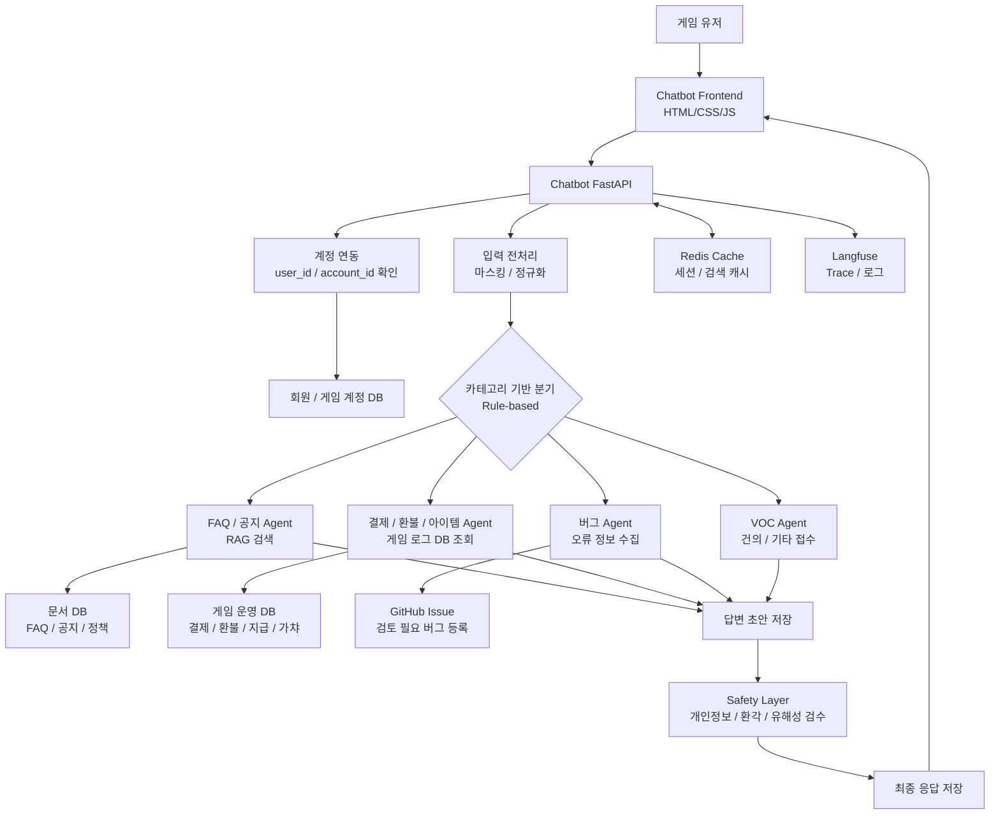
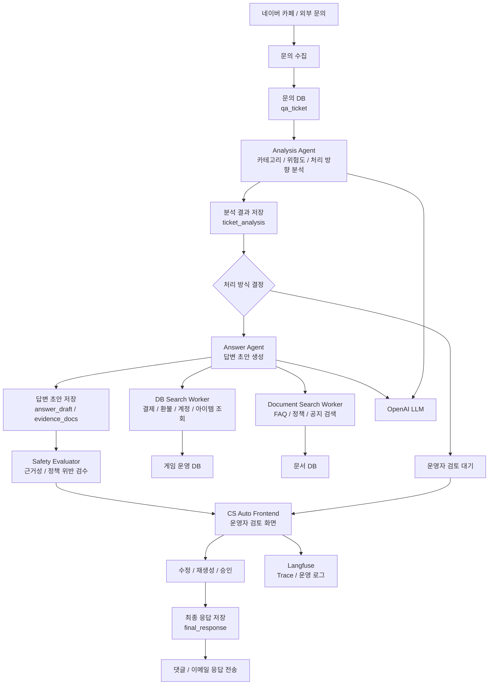
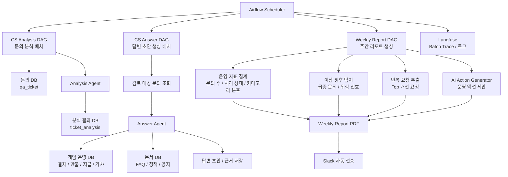

<div align="center">

# GameOps Support Platform

게임 고객지원 문의 접수, AI 답변 생성, 운영자 검수, 주간 운영 리포트까지 연결하는<br>AI 기반 CS 운영 자동화 플랫폼

<br>


<br>
<br>

<table align="center">
  <tr>
    <td align="center"><b>프로젝트</b></td>
    <td>SKN25 FINAL 6Team</td>
  </tr>
  <tr>
    <td align="center"><b>도메인</b></td>
    <td>게임 고객지원 CS 자동화</td>
  </tr>
  <tr>
    <td align="center"><b>핵심 기능</b></td>
    <td>Chatbot · CS Auto · Weekly Report</td>
  </tr>
  <tr>
    <td align="center"><b>주요 기술</b></td>
    <td>FastAPI · LangGraph · PostgreSQL/pgvector · Airflow · Docker</td>
  </tr>
</table>

</div>

<br>

---

<div align="center">

## 목차

</div>

<table align="center">
  <tr>
    <td valign="top" width="50%">

  **프로젝트 이해**
  - [1. 프로젝트 소개](#프로젝트-소개)
  - [2. 프로젝트 구조](#프로젝트-구조)
  - [3. 주요 기능](#주요-기능)
  - [4. 화면 예시](#화면-예시)
  - [5. 아키텍처](#아키텍처)

  </td>
  <td valign="top" width="50%">

  **구현 · 실행 · 검증**
  - [6. 주요 API](#주요-api)
  - [7. 데이터베이스](#데이터베이스)
  - [8. 데이터 수집 및 임베딩](#데이터-수집-및-임베딩)
  - [9. 배치 스케줄](#배치-스케줄)
  - [10. 설치 및 실행](#설치-및-실행)
  - [11. 테스트와 평가](#테스트와-평가)
  - [12. 기술 스택](#기술-스택)
  - [13. 참고 문서](#참고-문서)
  - [14. 팀원](#팀원)

  </td>
  </tr>
</table>

---

## 프로젝트 소개

<br>

GameOps Support Platform은 게임 서비스 운영에서 반복적으로 발생하는 고객 문의를 빠르고 일관되게 처리하기 위한 AI 기반 고객지원 시스템입니다.

사용자는 챗봇을 통해 결제, 버그, FAQ, VOC 문의를 접수하고 답변을 받을 수 있습니다. 챗봇은 입력 전처리, 카테고리 라우팅, DB 조회, 문서 검색 기반 RAG, 답변 생성, 안전성 검사를 거쳐 최종 응답을 생성합니다.

운영자는 CS Auto 화면에서 AI가 생성한 분석 결과와 답변 초안을 확인하고, 필요한 경우 초안을 수정하거나 재생성한 뒤 최종 승인할 수 있습니다. 승인된 답변은 고객에게 메일로 발송됩니다.

주간 운영 리포트는 Apache Airflow로 자동 실행됩니다. 최근 문의 추이, 카테고리별 증감, 이상 징후, 유저 개선 요청 Top 5, AI 권장 액션을 PDF로 생성하고 Slack 채널로 전송합니다.

<br>

---

## 프로젝트 구조

```text
SKN25-FINAL-6Team/
├── apps/
│   ├── chatbot/
│   │   ├── backend/
│   │   │   ├── api/                 # FastAPI endpoint
│   │   │   ├── chains/              # LangGraph workflow, routing, persistence
│   │   │   ├── generation/          # payment / bug / faq / voc agent
│   │   │   ├── repository/          # DB access layer
│   │   │   ├── safety/              # safety layer
│   │   │   ├── service/             # chatbot service
│   │   │   └── evals/               # chatbot evaluation scripts
│   │   └── frontend/static/         # chatbot static UI
│   │
│   ├── cs_auto/
│   │   ├── backend/
│   │   │   ├── agents/              # analysis agent, answer agent
│   │   │   ├── api/                 # CS Auto API and services
│   │   │   ├── airflow/             # Airflow DAGs
│   │   │   ├── evals/               # evaluation dataset builders
│   │   │   └── utils/               # login, email utilities
│   │   ├── frontend/                # operator UI
│   │   └── deploy/                  # app-specific deploy scripts
│   │
│   ├── weekly_report/
│   │   ├── ai/                      # AI action generation
│   │   ├── airflow/                 # weekly report DAG
│   │   ├── api/                     # report trigger API
│   │   ├── build/                   # report payload builders
│   │   ├── db/                      # report queries
│   │   ├── output/                  # PDF and Slack output
│   │   └── report.py                # pipeline entrypoint
│   │
│   └── tests/                       # service tests
│
├── common/
│   ├── db/                          # shared DB connection
│   ├── documents_processing/         # normalize, chunk, embed pipeline
│   ├── drafting/                    # shared answer drafting
│   ├── llm/                         # LLM client wrapper
│   ├── observability/               # shared Langfuse/logger
│   └── retrieval/                   # embedding, vector search, rerank
│
├── data/                            # keywords, prompts, raw data, SQL
├── deploy/                          # docker-compose, nginx, env example
├── docs/                            # PRD, architecture, DB, deploy, eval docs
├── assets/                          # screenshots, ERD images
└── requirements.txt
```

<br>

---

## 주요 기능

<br>

<table width="100%">
  <thead>
    <tr>
      <th width="33%">Chatbot</th>
      <th width="33%">CS Auto</th>
      <th width="33%">Weekly Report</th>
    </tr>
  </thead>
  <tbody>
    <tr>
      <td valign="top">
        <b>사용자 문의 접수 및 자동 응답</b><br><br>
        - 사용자 로그인 및 문의 이력 조회<br>
        - 결제 / 버그 / FAQ / VOC 카테고리 라우팅<br>
        - LangGraph 기반 멀티스텝 workflow<br>
        - 개인정보 마스킹 및 Prompt Injection 탐지<br>
        - DB 조회와 RAG 검색 기반 답변 생성<br>
        - Safety Layer 기반 최종 응답 검증
      </td>
      <td valign="top">
        <b>운영자 검수 및 답변 승인</b><br><br>
        - 검토 대상 티켓 목록 및 상세 조회<br>
        - AI 분석 결과, 초안, 근거 문서 확인<br>
        - 답변 초안 수정 / 재생성 / 승인<br>
        - 승인 답변 고객 메일 발송<br>
        - 새벽 시간대 Agent 배치 처리<br>
        - 고정 SQL / 동적 SQL 조회 전략 분리
      </td>
      <td valign="top">
        <b>기획팀용 주간 운영 리포트</b><br><br>
        - 매주 월요일 09:00 KST 자동 생성<br>
        - 문의량, 처리 상태, 카테고리 분포 집계<br>
        - 전주 대비 증감 및 이상치 탐지<br>
        - 유저 개선 요청 Top 5 산출<br>
        - AI 권장 액션 생성<br>
        - PDF 렌더링 후 Slack 전송
      </td>
    </tr>
  </tbody>
</table>

<br>

---

## 화면 예시

<table width="100%">
  <tr>
    <td align="center" width="50%">
      <b>Chatbot</b><br><br>
      
    </td>
    <td align="center" width="50%">
      <b>CS Auto</b><br><br>
      
    </td>
  </tr>
  <tr>
    <td align="center" width="50%">
      <b>Weekly Report</b><br><br>
      
    </td>
    <td align="center" width="50%">
      <b>Slack Report</b><br><br>
      
    </td>
  </tr>
</table>

<br>

---

## 아키텍처

### Chatbot Architecture

### CS Auto Architecture



### Weekly Report Architecture



### CS Auto Event Flow

CS Auto는 분석 Agent와 답변 초안 작성 Agent를 분리해 처리합니다. 분석 Agent는 미분석 문의를 읽고 카테고리, 감성, 위험도, 필요한 근거 자료 종류를 먼저 결정합니다. 답변 초안 작성 Agent는 분석 결과를 바탕으로 DB 또는 문서 근거를 수집하고, 고객 답변 초안과 안전성 결과를 생성합니다.

| 단계 | 역할 | 주요 처리 |
| :--- | :--- | :--- |
| 문의 분석 Agent | 미분석 문의 분석 | 카테고리, 감성, 위험도, 근거 자료 종류 결정 |
| 답변 초안 작성 Agent | 근거 기반 답변 생성 | DB/문서 근거 수집, 초안 작성, 안전성 검사 |
| 문서 검색 담당자 | 문서 근거 검색 | 공지, FAQ, 정책, 가이드 문서를 검색해 답변 생성에 필요한 근거 전달 |
| 답변 초안 작성 담당자 | 근거 기반 답변 제한 | 수집된 근거만 사용하도록 프롬프트와 생성 흐름을 제한해 임의 답변 방지 |
| 답변 안전성 검수 담당자 | 안전성 점수 판단 | 기준 미달 시 고정 답변 템플릿으로 전환 |

문의 분석 배치는 문의량이 가장 낮은 04~05시를 기준으로 실행합니다. 해당 시간대에 하루치 문의 데이터를 DB에서 조회해 Agent가 처리하고, 실시간 응대와 분석/답변 초안 생성 흐름이 서로 영향을 주지 않도록 분리했습니다.

안전성 기준 미달 시에는 고정 답변으로 전환합니다. 종합 안전성 점수는 아래 기준으로 계산하며, `0.7` 이하일 경우 고정 답변 템플릿을 사용합니다.

```text
종합 안전성 점수 = ((1 - 환각 점수) + (1 - 유해성 점수) + (1 - 정책위반 점수) + 사실성 점수) / 4
```

차단 또는 전환 대상:

- 환각 가능성이 높은 답변
- 유해 표현이 포함된 답변
- 정책 위반 가능성이 있는 답변
- 사실성 부족 답변

### DB 조회 전략

CS Auto의 DB 조회는 문의 유형에 따라 고정 SQL과 동적 SQL을 분리해 사용합니다. 반복 문의는 사전 정의된 SQL 템플릿으로 빠르게 조회하고, 복합 문의는 필요한 조건을 분석해 안전한 SQL로 변환해 실행합니다.

| 담당 모듈 | 역할 | 설명 |
| :--- | :--- | :--- |
| DB 조회 전략 결정 담당자 | 조회 방식 결정 | 문의 유형을 분석해 고정 SQL과 동적 SQL 중 적절한 조회 방식을 선택 |
| 고정 SQL 조회 담당자 | 반복 문의 빠른 조회 | 결제, 환불, 지급 내역 등 반복 문의를 사전 정의된 SQL 템플릿으로 조회 |
| 동적 SQL 조회 담당자 | 복합 문의 조회 | 복합 문의의 필요한 조건을 분석해 조회 계획을 만들고 안전한 SQL로 변환 |

이 구조를 통해 문의 유형별 SQL 조회 전략을 분리하고, 리소스 사용을 최적화하면서 응답 안정성을 확보했습니다.

<br>

### Weekly Report 구성

주간 운영 리포트는 기획팀과 운영자가 같은 지표를 기준으로 문제 흐름을 확인할 수 있도록 구성했습니다.

| 구성 요소 | 내용 |
| --- | --- |
| 타이틀 | 생성 날짜, 분석 단위 기간 |
| AI 요약 | 주간 지표 요약, AI 제안 권장 액션 |
| 주간 지표 | 결제, 지급, 아이템, 계정, 인게임버그 블록별 전주 대비 증감 표 |
| 급증/위험 문의 현황 | 전주 대비 폭증 문의, 일별 문의량, 시간별 문의량, 월별 폭증 문의, 주차별 문의량 요약 |
| 유저 개선 요청 Top 5 | 설계 결함, 편의 개선 중심의 개선 후보 |
| 목적 | 기획팀 전달, 가볍고 간결하게 참조 가능한 운영/마케팅 지표 제공 |

<br>

---

## 주요 API

### Chatbot API

| Method | Endpoint | 설명 |
| :--- | :--- | :--- |
| GET | `/health` | API 상태 확인 |
| GET | `/server-regions` | 서버/지역 목록 조회 |
| POST | `/login` | 사용자 로그인 |
| GET | `/tickets` | 사용자 문의 이력 조회 |
| POST | `/chat` | 챗봇 대화 요청 |

### CS Auto API

| Method | Endpoint | 설명 |
| :--- | :--- | :--- |
| GET | `/api/cs-auto/health` | API 상태 확인 |
| GET | `/api/cs-auto/tickets` | 검토 대상 티켓 목록 조회 |
| GET | `/api/cs-auto/tickets/{ticket_id}` | 티켓 상세 조회 |
| POST | `/api/cs-auto/auth/login` | 운영자 로그인 |
| POST | `/api/cs-auto/auth/logout` | 운영자 로그아웃 |
| PATCH | `/api/cs-auto/tickets/{ticket_id}/draft` | 답변 초안 수정 |
| POST | `/api/cs-auto/tickets/{ticket_id}/draft/regenerate` | 답변 초안 재생성 |
| POST | `/api/cs-auto/tickets/{ticket_id}/draft/approve` | 답변 초안 승인 |
| POST | `/api/cs-auto/tickets/{ticket_id}/send-email` | 고객 답변 메일 발송 |

### Weekly Report API

| Method | Endpoint | 설명 |
| :--- | :--- | :--- |
| GET | `/health` | API 상태 확인 |
| POST | `/report/trigger` | 주간 리포트 수동 생성 |

<br>

---

## 데이터베이스

라이브 DB 기준 요약은 [docs/DB/db_info.md](./docs/DB/db_info.md), 상세 스키마는 [docs/DB/descriptions.md](./docs/DB/descriptions.md)를 참고합니다.

| 영역 | 주요 테이블 | 설명 |
| :--- | :--- | :--- |
| 문의 | `qa_ticket` | 사용자 문의 원문, 상태, 접수 시각 |
| 사용자/계정 | `community_users`, `game_accounts` | 커뮤니티 사용자와 게임 계정 정보 |
| 분석 | `ticket_analysis` | 카테고리, 감성, 위험도, 라우팅 결과 |
| 답변 | `answer_draft`, `final_response` | AI 초안 및 최종 승인 답변 |
| 근거 | `evidence_docs` | 답변 생성에 사용된 근거 |
| 문서 RAG | `documents`, `documents_chunks`, `documents_embeddings` | 문서 원문, 청크, 임베딩 |
| 안전성 | `safety_results` | 환각, 유해성, 정책 위반, 사실성 점수 |
| 운영 로그 | `admin_event_logs`, `failed_queries`, `notification_logs` | 운영 이벤트, 실패 쿼리, 알림 이력 |
| 업무 로그 | `payments`, `refunds`, `item_delivery_logs`, `gacha_logs` | 결제, 환불, 지급, 가챠 관련 근거 |
| 인사이트 | `insight` | 반복 이슈와 패턴 위험도 |

<br>

---

## 데이터 수집 및 임베딩

### 데이터 설명

| 데이터 영역 | 기능 및 역할 | 주요 테이블 |
| :--- | :--- | :--- |
| 문의 접수 데이터 | 고객 문의 접수 및 사용자/계정 식별 | `qa_ticket`, `community_users`, `game_accounts` |
| 사용자 로그 데이터 | 결제, 환불, 아이템 지급, 가챠 등 문의 해결에 필요한 업무 로그 조회 | `payments`, `refunds`, `item_delivery_logs`, `gacha_logs` |
| 문서 검색 데이터 | 정책 문서 RAG 검색, FAQ/공지/가이드 문서 저장, 답변 근거 활용 | `documents`, `documents_chunks`, `documents_embeddings` |
| 분석/답변 결과 데이터 | 티켓 분석, 답변 초안 생성, 참조 근거 저장, 최종 답변 및 패턴 인사이트 관리 | `ticket_analysis`, `answer_draft`, `evidence_docs`, `final_response`, `insight` |

### 데이터 수집

| 수집 경로 | 수집 건수 |
| --- | ---: |
| QNA API URL (`authkey` 포함) | 85건 |
| 네이버 카페 URL | 1,114건 |
| 정상 URL (약관/개인정보) | 2건 |
| 빈 URL | 0건 |

원본 문서 생성 단계에서는 HTML 태그, HTML entity, 제로폭 문자, 불필요한 공백과 줄바꿈을 정리했습니다. 또한 게시판 UI 문구인 `목록으로`, `이전 글`, `공유하기`, `댓글`, `조회`, `스크랩`처럼 검색 가치가 낮은 줄을 제거했습니다.

카테고리 기준으로는 `성우 공개` 문서 99건을 제외했습니다. 고객센터 문의 해결과 직접 관련이 낮고 검색 결과를 흐릴 가능성이 높기 때문입니다. 본문이 전처리 후 완전히 비어버린 문서도 제거했으며, 이번 기준으로 11건이 제거됐습니다.

### 문서 청킹

- FAQ는 `질문 + 답변` 한 세트를 하나의 chunk로 유지했습니다.
- 정책 문서는 조항 단위로 먼저 분리했습니다.
- 공지와 가이드는 소제목과 문단 길이를 기준으로 분리했습니다.
- 너무 긴 chunk는 문단 기준으로 다시 나눴습니다.
- 중복 chunk는 hash 기준으로 제거했습니다.

### 임베딩 평가

검색 성능은 세 모델 모두 정답 문서를 상위 5개 안에 100% 검색했습니다. 1순위 정답 문서 비율도 모두 `27/30`으로 동일했습니다.

| 항목 | `small1536` | `large1536` | `large3072` |
| :--- | ---: | ---: | ---: |
| `source_hit@5` | 30 / 30 | 30 / 30 | 30 / 30 |
| `top1_hit` | 27 / 30 | 27 / 30 | 27 / 30 |

품질 평가에서는 `large3072`가 가장 높았지만, 비용 대비 효과를 고려해 `text-embedding-3-small` 1536차원을 최종 선택했습니다.

| 항목 | `small1536` | `large1536` | `large3072` |
| :--- | ---: | ---: | ---: |
| `context_precision` | 0.8324 | 0.8474 | 0.8419 |
| `context_recall` | 0.8500 | 0.8500 | 0.8667 |
| `faithfulness` | 0.8668 | 0.9043 | 0.9227 |
| 종합 평균 | 0.8497 | 0.8672 | 0.8771 |

| 모델 | 가격 |
| --- | --- |
| `text-embedding-3-small` | $0.020 / 1M tokens |
| `text-embedding-3-large` | $0.130 / 1M tokens |

평가 설계는 RAGAS, ARES, CRUD-RAG의 RAG 검색/품질 평가 관점을 참고했습니다.

<br>

---

## 배치 스케줄

| DAG ID | 스케줄 | 설명 |
| :--- | :--- | :--- |
| `cs_auto_analysis_agent_daily` | 매일 04:00 KST | 신규 문의 분석 및 `ticket_analysis` 저장 |
| `cs_auto_answer_agent_daily` | 매일 07:00 KST | 분석 결과 기반 답변 초안 생성 |
| `dashboard_weekly_report` | 매주 월요일 09:00 KST | 주간 리포트 PDF 생성 및 Slack 발송 |

<br>

---

## 설치 및 실행

### 사전 요구사항

- Python 3.12+
- PostgreSQL 16+ 및 pgvector
- Docker / Docker Compose
- LLM API Key
- Slack Bot Token 또는 Slack Webhook URL
- SMTP App Password

### 환경 변수

```powershell
cd deploy
Copy-Item .env.example .env
```

최소 필수 값:

```env
DB_HOST=
DB_PORT=5432
DB_USER=game_cs_user
DB_PASSWORD=
DB_NAME=game_cs

LLM_API_KEY=
LLM_MODEL=
```

주요 선택 값:

```env
CHATBOT_CORS_ORIGINS=http://localhost,http://127.0.0.1
CHATBOT_LANGFUSE_ENABLED=
CHATBOT_LANGFUSE_PUBLIC_KEY=
CHATBOT_LANGFUSE_SECRET_KEY=
CHATBOT_LANGFUSE_HOST=
CHATBOT_LANGFUSE_PROJECT=chatbot
CHATBOT_DEBUG_ROUTING=false

CS_AUTO_API_CORS_ORIGINS=*
CS_AUTO_CORS_ORIGINS=
CS_AUTO_REGENERATION_LIMIT=3
CS_AUTO_ROUTING_MODEL=
SMTP_APP_PASSWORD=
SMTP_HOST=smtp.gmail.com
SMTP_PORT=587
CS_AUTO_LANGFUSE_ENABLED=
CS_AUTO_LANGFUSE_PUBLIC_KEY=
CS_AUTO_LANGFUSE_SECRET_KEY=
CS_AUTO_LANGFUSE_HOST=
CS_AUTO_LANGFUSE_PROJECT=cs-auto

DASHBOARD_WEEKLY_REPORT_CHANNEL=
DASHBOARD_WEEKLY_REPORT_COMMENT=
DASHBOARD_SLACK_BOT_TOKEN=
WEEKLY_REPORT_LANGFUSE_ENABLED=
WEEKLY_REPORT_LANGFUSE_PUBLIC_KEY=
WEEKLY_REPORT_LANGFUSE_SECRET_KEY=
WEEKLY_REPORT_LANGFUSE_HOST=
WEEKLY_REPORT_LANGFUSE_PROJECT=weekly-report
```

전체 예시는 [deploy/.env.example](./deploy/.env.example)에 있습니다.

### 의존성 설치

아래 명령은 `SKN25-FINAL-6Team` 저장소 루트에서 실행하는 기준입니다.

```powershell
python -m venv .venv
.\.venv\Scripts\Activate.ps1
python -m pip install --upgrade pip
python -m pip install -r requirements.txt

python -m pip install -r apps\chatbot\backend\requirements.txt
python -m pip install -r apps\cs_auto\backend\requirements.txt
python -m pip install -r apps\weekly_report\requirements.txt
```

### 로컬 실행

각 백엔드 실행 명령은 `SKN25-FINAL-6Team` 저장소 루트에서 실행하는 기준입니다.

Chatbot Backend:

```powershell
$env:PYTHONPATH="$PWD;$PWD\apps\chatbot\backend"
python -m uvicorn api.main:app --host 127.0.0.1 --port 8000
```

```text
http://127.0.0.1:8000/health
```

Chatbot Frontend:

```powershell
cd apps\chatbot\frontend\static
python -m http.server 5173
```

```text
http://127.0.0.1:5173
```

CS Auto Backend:

```powershell
$env:PYTHONPATH="$PWD;$PWD\apps\cs_auto\backend"
python -m uvicorn api.main:app --host 127.0.0.1 --port 8001
```

```text
http://127.0.0.1:8001/api/cs-auto/health
```

CS Auto Frontend:

```powershell
cd apps\cs_auto\frontend
python -m http.server 5174
```

```text
http://127.0.0.1:5174/cs_automation.html
```

Weekly Report API:

```powershell
$env:PYTHONPATH="$PWD;$PWD\apps\weekly_report"
python -m uvicorn api.main:app --host 127.0.0.1 --port 8002
```

```text
http://127.0.0.1:8002/health
```

수동 리포트 생성:

```powershell
Invoke-WebRequest -Method POST http://127.0.0.1:8002/report/trigger
```

### Docker 실행

```powershell
cd deploy
Copy-Item .env.example .env

docker compose --env-file .env -f docker-compose.chatbot.yml up -d --build
docker compose --env-file .env -f docker-compose.cs-auto.yml up -d --build
docker compose --env-file .env -f docker-compose.airflow.yml up -d --build
```

중지:

```powershell
docker compose -f docker-compose.chatbot.yml down
docker compose -f docker-compose.cs-auto.yml down
docker compose -f docker-compose.airflow.yml down
```

### 문서 처리 CLI

```powershell
$env:PYTHONPATH="$PWD"
python -m common.documents_processing.cli --source-type faq --limit 10
python -m common.documents_processing.cli --dry-run --log-level DEBUG
```

<br>

---

## 테스트와 평가

### 테스트 실행

```powershell
pytest
pytest apps\tests\chatbot_tests
pytest apps\tests\cs-auto_tests
pytest apps\tests\weekly_report_tests
pytest common\tests
```

일부 통합 테스트는 실제 DB, LLM, Slack, SMTP 환경 변수를 필요로 합니다.

### CS Auto 평가 요약

CS 자동화 평가는 분석 단계와 답변 생성 단계를 분리해 측정했습니다. 분석 단계는 문의 유형, 위험도, 사용할 문서 선택의 정확성을 확인했고, 답변 생성 단계는 DB 조회와 문서 검색, 정답 근거 문단 탐색 성능을 중심으로 평가했습니다.

#### 문의 분석 성능

총 143건 기준으로 평가했습니다.

| 평가 항목 | 결과 | 정확도 |
| :--- | :--- | :--- |
| 위험 문의 판단 | 132 / 143 | 92.3% |
| 문의 유형 분류 | 126 / 143 | 88.1% |
| 사용 문서 선택 | 117 / 143 | 81.8% |
| 고객 감정 판단 | 111 / 143 | 77.6% |

세부 항목:

| 세부 항목 | 결과 |
| --- | --- |
| 고정 답변 대상 탐지 | 20 / 20 |
| DB 조회형 문의 탐지 | 27 / 39 |

#### 답변 생성 성능

총 64건 기준으로 평가했으며, DB 조회 28건과 문서 검색 36건을 중심으로 확인했습니다.

| 평가 항목 | 결과 | 정확도 |
| :--- | :--- | :--- |
| DB 조회 판단 | 27 / 28 | 96.4% |
| 문서 검색 실행 | 36 / 36 | 100% |
| 정답 문서 탐색 | 30 / 36 | 83.3% |
| 정답 근거 문단 탐색 | 32 / 36 | 88.9% |

결론: 분석 단계는 처리 경로 선택, 답변 단계는 정확한 문서 및 근거 문단 탐색이 우선입니다.

평가 상세:

- [apps/cs_auto/PERFORMANCE_EVAL_RESULTS.md](./apps/cs_auto/PERFORMANCE_EVAL_RESULTS.md)
- [apps/cs_auto/PERFORMANCE_METRICS_INTERPRETATION.md](./apps/cs_auto/PERFORMANCE_METRICS_INTERPRETATION.md)
- [docs/test_strategy.md](./docs/test_strategy.md)

<br>

---

## 기술 스택

### Backend

<table width="100%">
  <tr>
    <td width="20%"><b>Framework</b></td>
    <td>
      
      
    </td>
  </tr>
  <tr>
    <td><b>Language</b></td>
    <td></td>
  </tr>
  <tr>
    <td><b>Schema/Auth</b></td>
    <td>
      
      
    </td>
  </tr>
</table>

### AI / Retrieval

<table width="100%">
  <tr>
    <td width="20%"><b>Workflow</b></td>
    <td>
      
      
    </td>
  </tr>
  <tr>
    <td><b>Retrieval</b></td>
    <td>
      
      
      
    </td>
  </tr>
  <tr>
    <td><b>Safety</b></td>
    <td></td>
  </tr>
</table>

### Infra / Integration

<table width="100%">
  <tr>
    <td width="20%"><b>Database</b></td>
    <td>
      
      
      
    </td>
  </tr>
  <tr>
    <td><b>Batch/Deploy</b></td>
    <td>
      
      
      
    </td>
  </tr>
  <tr>
    <td><b>Report/Observe</b></td>
    <td>
      
      
      
      
    </td>
  </tr>
</table>

<br>

---

## 참고 문서

| 문서 | 설명 |
| --- | --- |
| [docs/DB/db_info.md](./docs/DB/db_info.md) | 라이브 DB 정보 |
| [docs/DB/descriptions.md](./docs/DB/descriptions.md) | DB 테이블/컬럼 상세 |
| [docs/weekly_report/prd.md](./docs/weekly_report/prd.md) | 주간 리포트 요구사항 |
| [docs/weekly_report/architecture.md](./docs/weekly_report/architecture.md) | 주간 리포트 아키텍처 |
| [docs/cs_auto/analysis_agent_eval.md](./docs/cs_auto/analysis_agent_eval.md) | 분석 Agent 평가 |
| [docs/cs_auto/analysis_agent_mermaid.md](./docs/cs_auto/analysis_agent_mermaid.md) | 분석 Agent 흐름도 |
| [docs/chatbot/refactor-handoff.md](./docs/chatbot/refactor-handoff.md) | 챗봇 리팩터링 인수인계 |
| [deploy/README.md](./deploy/README.md) | 배포 메모 |

<br>

---

## 팀원

<br>

<div align="center">

<table align="center">
  <tr>
    <th align="center">김나연</th>
    <th align="center">이하윤</th>
    <th align="center">이상민</th>
    <th align="center">박성진</th>
    <th align="center">임하영</th>
  </tr>
  <tr>
    <td align="center">팀장<br>CS Auto 전체 설계 및 구현</td>
    <td align="center">챗봇 RAG 파이프라인<br>공통 모듈</td>
    <td align="center">Weekly Report<br>Airflow / Slack</td>
    <td align="center">챗봇 프론트엔드<br>DB 설계</td>
    <td align="center">CS Auto 에이전트<br>인프라 배포</td>
  </tr>
  <tr>
    <td align="center">
      <a href="https://github.com/rosie1025">
        
      </a>
    </td>
    <td align="center">
      <a href="https://github.com/lhyckh6628">
        
      </a>
    </td>
    <td align="center">
      <a href="https://github.com/Sangmin630">
        
      </a>
    </td>
    <td align="center">
      <a href="https://github.com/pureunsaerok">
        
      </a>
    </td>
    <td align="center">
      <a href="https://github.com/acegikmoop-code">
        
      </a>
    </td>
  </tr>
</table>

</div>
