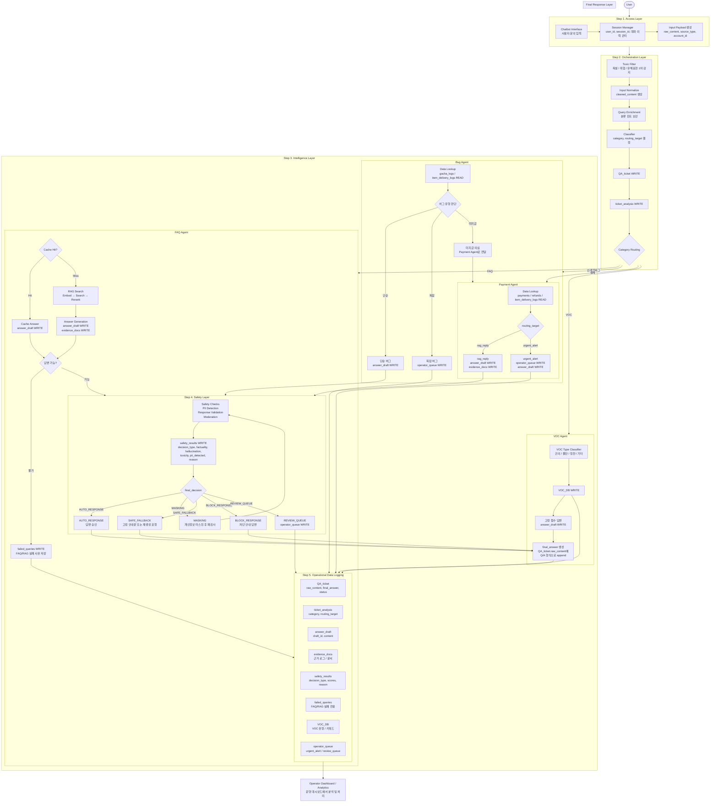

# Chatbot Workflow Mermaid

이 문서는 챗봇의 최종 workflow를 Mermaid 기준으로 정리합니다.

현재 메인 실행 경로는 `chatbot/agent.py`의 LangChain `create_agent`이며, 이 폴더의 `workflow.py`는 LangGraph `StateGraph` 전환을 위한 실험 경로입니다. 최종 설계에서는 `StateGraph`가 전체 처리 순서와 분기를 관리하고, 각 node 내부에서 tools 또는 agent 로직을 사용합니다.

## Workflow



## Layer Summary

| Layer | 책임 |
|------|------|
| Access Layer | 사용자 문의 입력, 세션 식별, 입력 payload 생성 |
| Orchestration Layer | 입력 정제, 문의 분류, 라우팅 결정, 티켓/분석 결과 저장 |
| Intelligence Layer | FAQ, Bug, Payment, VOC별 근거 조회 및 답변 초안 생성 |
| Safety Layer | 답변 초안 검증, `decision_type` 저장, 안전성 분기 결정 |
| Final Response Layer | 사용자에게 나갈 최종 답변 생성 및 Q/A 누적 준비 |
| Operational Data Logging | 운영 대시보드가 소비할 데이터 적재 |

## Storage Policy

챗봇은 운영 인사이트를 직접 계산하지 않고, 운영 대시보드가 분석할 수 있는 데이터를 남기는 역할까지만 담당합니다.

```text
QA_ticket
  -> 사용자 문의 원문, 최종 답변, 상태 저장

ticket_analysis
  -> category, routing_target 저장

answer_draft
  -> agent가 생성한 답변 초안 저장

evidence_docs
  -> 답변 근거가 된 로그 또는 문서 저장

safety_results
  -> decision_type, safety score, reason 저장

failed_queries
  -> FAQ/RAG에서 답변 근거를 찾지 못한 질문만 저장

VOC_DB
  -> VOC 유형, 키워드, 원문/정규화 질의 저장

operator_queue
  -> urgent_alert, review_queue 등 운영자 확인 대상 저장
```

## Current Implementation Note

현재 코드의 LangGraph 실험 경로는 아래 흐름까지 구현되어 있습니다.

```text
orchestrator
  -> category agent
     -> VOC이면 final_response
     -> 결제/인게임버그/FAQ이면 safety_layer -> final_response
  -> END
```

현재 구현은 seed/mock tool 기반 baseline입니다. 실제 RAG/ChromaDB 검색과 운영 대시보드 연동은 후속 작업으로 연결합니다. `QA_ticket.raw_content` append는 `append_qa_ticket_message` tool 계약으로 준비되어 있습니다.

## Run

현재 `runners/run_chatbot.py`는 LangGraph `StateGraph` 경로를 실행합니다.

```bash
python3 runners/run_chatbot.py
```

현재 공식 챗봇 실행 runner는 `chatbot.graph.workflow.graph`를 호출합니다.

```text
runners/run_chatbot.py
  -> chatbot.graph.workflow.graph
  -> orchestrator
  -> category agent
  -> VOC이면 final_response
  -> 결제/인게임버그/FAQ이면 safety_layer
  -> final_response
```

주의할 점은 category agent 내부에서 공통 `create_agent` reasoning을 호출할 수 있다는 점입니다. 따라서 graph runtime 검증은 OpenAI API 연결이 가능한 환경에서 실행해야 합니다.
