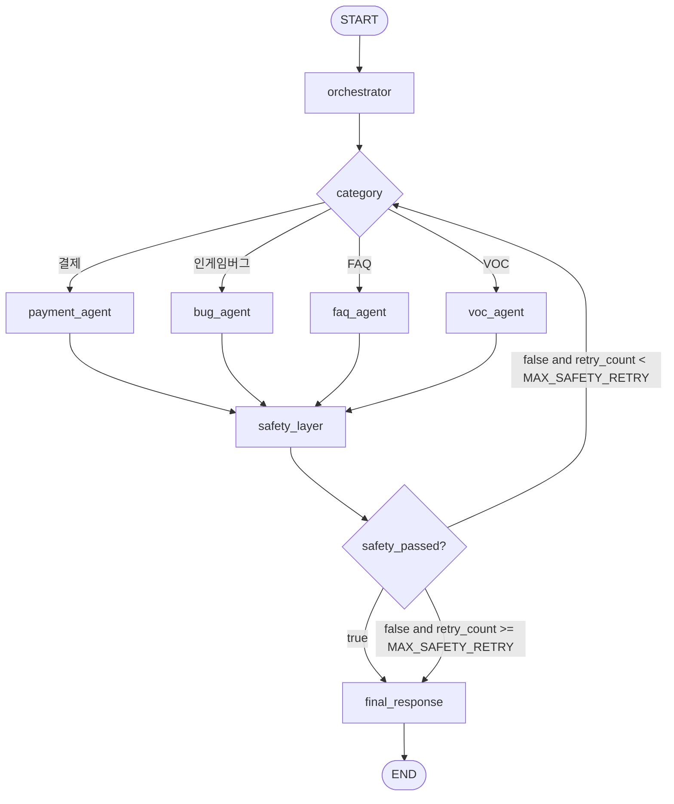

# Chatbot LangGraph Workflow

이 폴더는 챗봇을 LangGraph node 기반 구조로 전환하기 위한 workflow를 담습니다.

현재 메인 실행 경로는 아직 `chatbot/agent.py`의 LangChain `create_agent`입니다. 이 폴더의 `workflow.py`는 기존 데모를 깨지 않고 LangGraph 구조를 실험하기 위한 별도 경로입니다.

## 현재 그래프 구조

```text
orchestrator
  -> payment_agent
  -> bug_agent
  -> faq_agent
  -> voc_agent

각 category agent
  -> safety_layer
  -> final_response
  -> END
```

Mermaid로 표현하면 다음과 같습니다.



## 주요 파일

| 파일 | 역할 |
|------|------|
| `workflow.py` | `StateGraph(ChatbotState)` 조립 및 `graph` export |
| `__init__.py` | graph package marker |

## Routing

`workflow.py`에는 두 개의 routing 함수가 있습니다.

```text
_route_by_category(state)
```

역할:

```text
category = 결제       -> payment_agent
category = 인게임버그 -> bug_agent
category = VOC        -> voc_agent
그 외                -> faq_agent
```

```text
_route_after_safety(state)
```

역할:

```text
safety_passed = True
  -> final_response

safety_passed = False and retry_count >= MAX_SAFETY_RETRY
  -> final_response

safety_passed = False and retry_count < MAX_SAFETY_RETRY
  -> 기존 category agent로 재시도
```

## 실행 예시

프로젝트 루트에서 실행합니다.

```bash
/opt/anaconda3/bin/python3 - <<'PY'
from chatbot.graph.workflow import graph

result = graph.invoke({
    "messages": [],
    "ticket_id": 1001,
    "user_id": "seed-user",
    "session_id": "seed-session",
    "account_id": 101,
    "source_type": "chatbot",
    "raw_content": "결제는 정상적으로 완료됐는데 구매한 스타터 패키지 아이템이 아직 들어오지 않았습니다.",
    "cleaned_content": "",
    "category": "",
    "routing_target": "",
    "draft_id": None,
    "answer_draft": None,
    "safety_passed": None,
    "retry_count": 0,
})

print(result["category"])
print(result["routing_target"])
print(result["draft_id"])
print(result["safety_passed"])
print(result["final_decision"])
print(result["final_answer"])
print(result["answer_draft"])
PY
```

예상 결과:

```text
결제
urgent_alert
6001
True
AUTO_RESPONSE
...
```

## 현재 한계

```text
- 기존 runners/run_chatbot.py는 아직 create_agent 경로를 사용한다.
- workflow.py는 별도 실험 경로이며 메인 서비스 경로가 아니다.
- category 분류는 LLM이 아니라 keyword baseline이다.
- FAQ Agent는 현재 cache 기반 baseline이며 실제 RAG/ChromaDB 검색은 아직 연결되지 않았다.
- failed_queries는 FAQ/RAG 답변 근거 미발견 케이스 전용으로 둔다.
- safety 5종 분기 결과는 safety_results.decision_type에 저장하는 방향이다.
- BLOCK_RESPONSE / REVIEW_QUEUE / SAFE_FALLBACK도 final_response에서 사용자-facing 고정 답변으로 변환한다.
- 현재 final_response는 final_answer를 state에 남기는 baseline이며 QA_ticket.raw_content append는 아직 mock 자리만 있다.
- routing_target 기반 Operator Dashboard 분기는 아직 없다.
- safety retry는 feedback 기반 재생성이 아니라 동일 category agent 재호출 구조다.
```

## 다음 작업

```text
1. workflow 실행 runner 추가
2. routing_target = urgent_alert일 때 Operator Dashboard 큐 분기 추가
3. safety final_decision 기반 분기 추가
4. QA_ticket.raw_content append tool 추가 및 final_response에 연결
5. create_agent baseline과 LangGraph workflow 중 최종 메인 경로 결정
```
