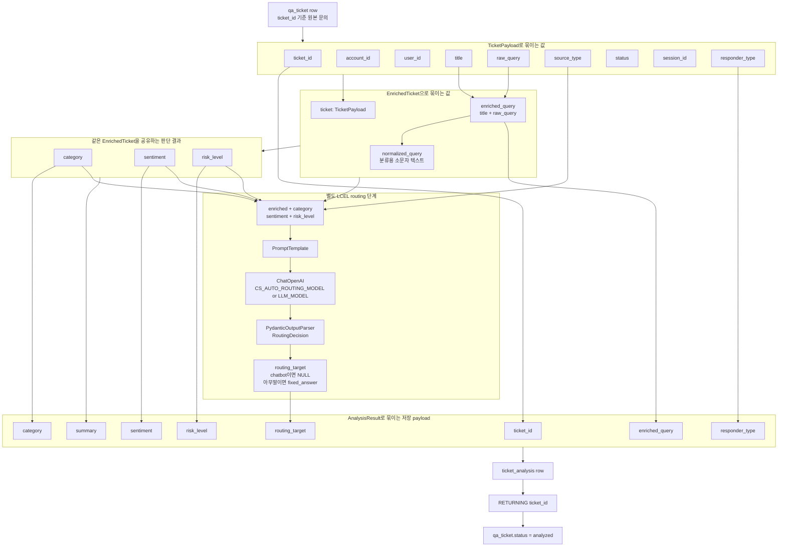
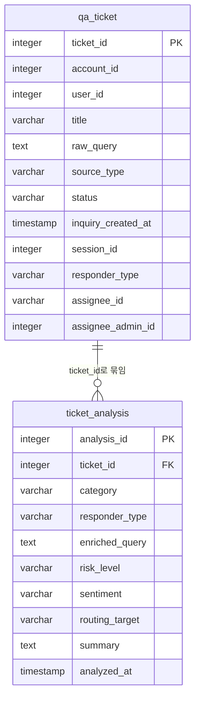
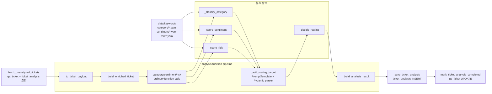

# Analysis Agent Binding Diagram

`apps/cs_auto/backend/agents/analysis_agent.py`는 `qa_ticket` 1건을 `ticket_id` 기준으로 분석하고, 그 결과를 `ticket_analysis`에 저장한 뒤 원본 티켓 상태를 갱신하는 배치 로직이다.

핵심 묶임은 다음과 같다.

- `qa_ticket.ticket_id`가 전체 흐름의 기준 키다.
- `qa_ticket`에서 읽은 컬럼은 `TicketPayload`로 묶인다.
- `TicketPayload`는 `EnrichedTicket`으로 감싸져 분석 함수들의 공통 입력이 된다.
- 분류/감성/위험도 키워드는 `data/keywords`의 각 폴더에 있는 YAML 파일에서 로드한다.
- 분석 함수들의 결과는 `AnalysisResult`로 묶인다.
- `source_type`이 `chatbot`이면 `routing_target`은 만들지 않고 `NULL`로 둔다.
- 그 외 문의의 `routing_target`은 `category`, `sentiment`, `risk_level`, `enriched_query`를 받은 별도 LCEL 라우팅 단계에서 결정된다.
- 라우팅 단계는 `PromptTemplate -> ChatOpenAI -> PydanticOutputParser` 구조로 `RoutingDecision`을 만든다.
- 답변할 근거가 없는 짧은 잡담/아무말은 `fixed_answer`로 보낸다.
- `AnalysisResult`는 `ticket_analysis`에 저장된다.
- 저장이 끝난 티켓은 `qa_ticket.status = analyzed`로 갱신된다.

## 전체 묶임 구조

## DB 테이블끼리 묶이는 기준

## 함수끼리 묶이는 기준

## 키워드 사전 파일

| YAML 경로 | 의미 |
| --- | --- |
| `category/payment.yaml` | 결제, 구매, 유료 재화, 스토어 결제, 미지급 |
| `category/refund.yaml` | 환불, 청약철회, 구매 취소 |
| `category/account.yaml` | 계정, 로그인, 연동, 복구, 도용 |
| `category/bug.yaml` | 버그, 오류, 튕김, 진행 불가, 패치 오류 |
| `category/gacha.yaml` | 가챠, 뽑기, 확률, 천장, 픽업 |
| `category/policy.yaml` | 정책, 제재, 신고, 어뷰징, 약관 |
| `sentiment/negative.yaml` | 불만, 분노, 재촉, 운영 불신 표현 |
| `sentiment/positive.yaml` | 감사, 요청, 확인 부탁 표현 |
| `risk/high.yaml` | 법적 대응, 개인정보, 결제 피해, 도용, 확률 조작 |

## 컬럼 묶임 요약

| 묶임 단위 | 함께 묶이는 컬럼/값 | 다음으로 연결되는 곳 |
| --- | --- | --- |
| 원본 티켓 | `qa_ticket.ticket_id`, `account_id`, `user_id`, `title`, `raw_query`, `source_type`, `status`, `inquiry_created_at`, `session_id`, `responder_type` | `TicketPayload` |
| 분석 입력 | `TicketPayload`, `enriched_query`, `normalized_query` | category/sentiment/risk/routing 판단 함수 |
| 판단 결과 | `category`, `sentiment`, `risk_level` | 별도 LCEL routing 단계 |
| 라우팅 결과 | `routing_target` | `AnalysisResult`. `source_type = chatbot`이면 `NULL`, 아무말이면 `fixed_answer` |
| 저장 payload | `ticket_id`, `category`, `responder_type`, `enriched_query`, `risk_level`, `sentiment`, `routing_target`, `summary` | `ticket_analysis` |
| 처리 완료 상태 | `ticket_analysis.ticket_id` | `qa_ticket.status = analyzed` |

## 한 줄 요약

`qa_ticket.ticket_id` 하나를 중심으로 원본 문의, 분석 결과, 상태 변경이 묶인다.
