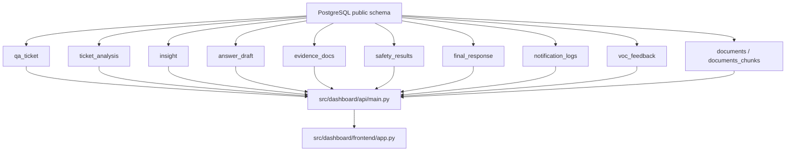

# Dashboard Architecture

`docs/DB/descriptions.md`에 정의된 운영 데이터베이스를 읽어서, Streamlit 기반 대시보드가 운영 현황, 리스크, 응답 품질을 한 화면 계열로 보여주는 구조다.

## 목표

- 운영팀이 현재 처리량과 backlog를 빠르게 확인한다.
- 분석팀이 위험 티켓과 안전성 점수를 바로 추적한다.
- 품질 관리자가 답변 초안, 근거 문서, 최종 응답의 품질을 검토한다.

## 데이터 흐름

## Runtime layout

- `src/dashboard/api/main.py`
  - PostgreSQL에서 집계 데이터를 읽는 FastAPI 서버
  - 페이지별 summary endpoint와 티켓 상세 endpoint 제공
- `src/dashboard/frontend/app.py`
  - Streamlit 시작점
  - 좌측 사이드바에서 API 주소와 조회 범위 제어
- `src/dashboard/frontend/pages/`
  - `1_운영_현황.py`
  - `2_리스크_분석.py`
  - `3_응답_품질.py`
- `src/dashboard/frontend/components/`
  - metric card, chart box, data table 렌더링 공통화
- `src/dashboard/visualization/`
  - 응답 데이터를 화면용 표로 정리하는 보조 함수

## 페이지 역할

### 1. 운영 현황

- 티켓 총량, 대기 건수, 종료 건수, 당일 접수 건수
- `source_type` 분포와 `status` 분포
- 최신 `ticket_analysis` 기준 카테고리와 라우팅 타깃
- 최근 티켓 목록과 상세 진입점

### 2. 리스크 분석

- `ticket_analysis.risk_level` 분포
- `insight.risk_level` 및 `insight.pattern_risk_level` 분포
- `safety_results` 평균 점수와 고위험 후보
- `voc_feedback` 키워드와 `documents` 기반 정책/장애 맥락 확인

### 3. 응답 품질

- 답변 초안 생성률
- 증거 문서 연결률
- `safety_results`의 hallucination, toxicity, policy_violation, factuality 점수
- `final_response` 생성률
- `notification_logs` 전송 상태 분포

## 구현 원칙

- 집계는 DB에서 수행하고 UI는 렌더링에 집중한다.
- 최신 값이 중요한 지표는 각 티켓별 `DISTINCT ON` 또는 최신 timestamp 기준으로 한 건만 사용한다.
- 숫자/비율/분포는 endpoint에서 계산해 Streamlit은 그대로 표시한다.
- 상세 조회는 `ticket_id` 단위로 `qa_ticket`, `ticket_analysis`, `answer_draft`, `evidence_docs`, `safety_results`, `final_response`, `notification_logs`를 한 번에 가져온다.

