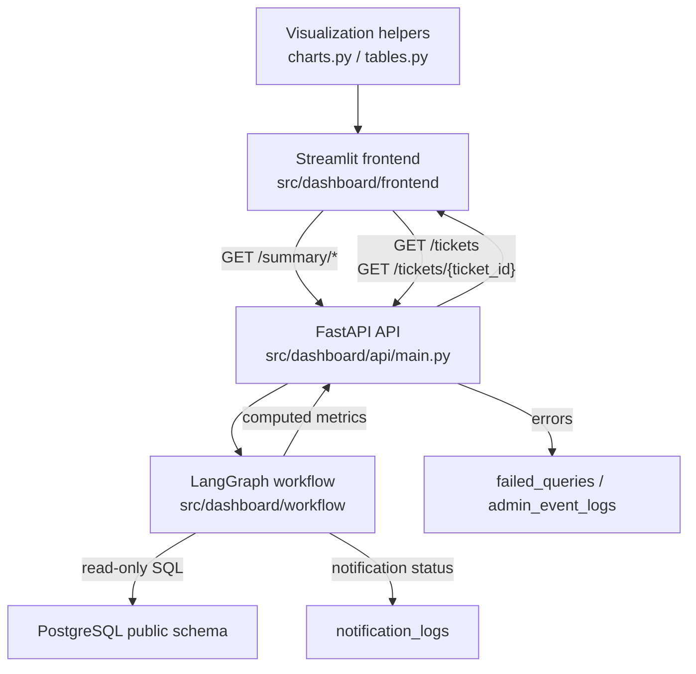
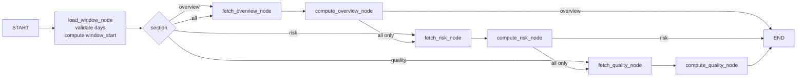
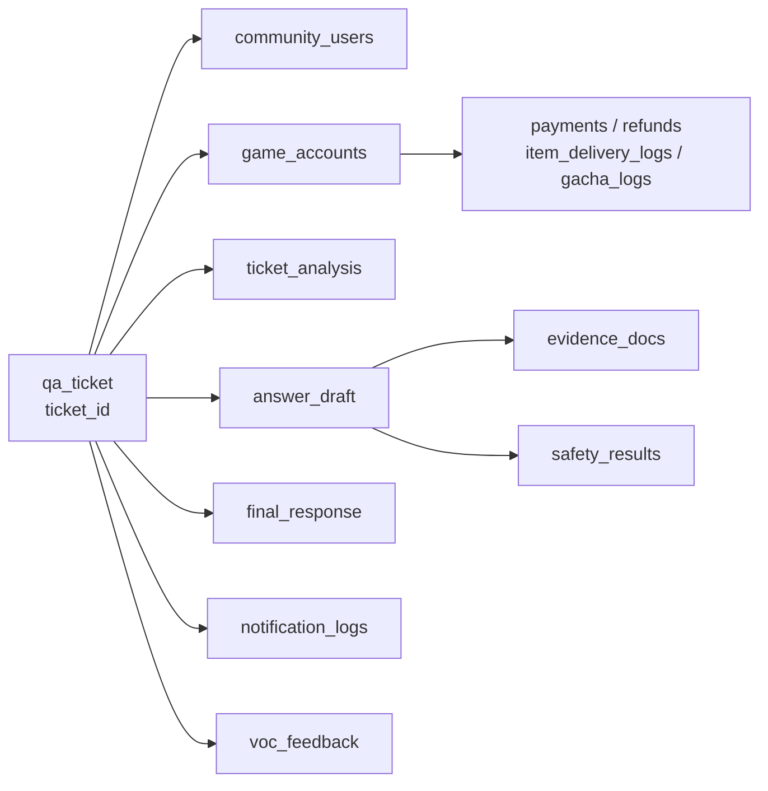
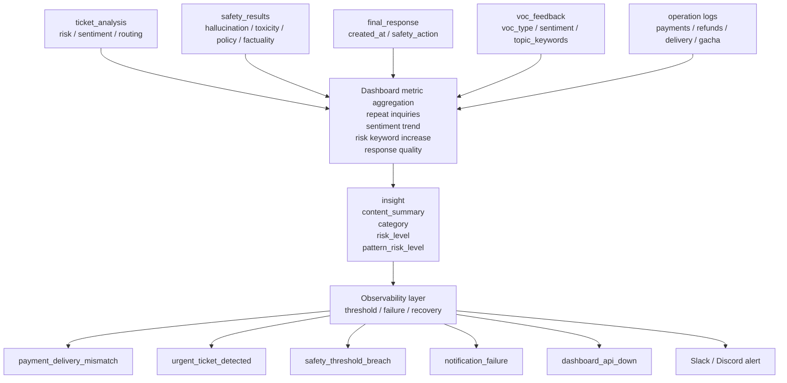

# Dashboard Architecture

이 문서는 `docs/dashboard/prd.md`, `docs/dashboard/metrics.md`,
`docs/dashboard/api_spec.md`를 기준으로 Dashboard의 API, LangGraph workflow,
Streamlit 화면, DB 조회 책임을 정의한다. 별도 `docs/dashboard/mermaid.mmd`에 있던
인사이트/관측 다이어그램은 이 문서의 "인사이트와 관측 흐름" 섹션으로 통합했다.

## 목표

- 운영자는 최근 문의 수, pending backlog, closed 건수, 오늘 접수 건수, 답변율과 평균 지연을 빠르게 확인한다.
- 리스크 담당자는 HIGH/critical 문의, 부정 감성 증가, safety threshold 위반 후보를 우선 검토한다.
- 답변 품질 관리자는 초안, 근거 문서, safety 검사, 최종 답변, 알림 발송 상태를 한 화면에서 확인한다.
- 상담 검토자는 `human_review`, `urgent_alert`, 검증 미달 문의의 상세 맥락과 후속 조치 근거를 확인한다.
- 시스템 관리자는 API health, DB 조회 실패, Slack/Discord 알림 실패를 추적한다.

## 범위

Dashboard는 읽기 전용 운영 도구다. 결제, 환불, 아이템 지급, 답변 수정 같은 실제 업무 처리는
기존 operation workflow 또는 관리자 도구에서 수행하고, Dashboard는 판단에 필요한 근거와 이동 맥락을 제공한다.

## 주요 모듈

| Layer | Path | Responsibility |
| --- | --- | --- |
| API | `src/dashboard/api/main.py` | FastAPI endpoint, 요청 검증, workflow 호출, 오류 응답 |
| Workflow state | `src/dashboard/workflow/state.py` | LangGraph 상태 모델과 summary section 정의 |
| Workflow nodes | `src/dashboard/workflow/nodes.py` | DB 조회, 최신 레코드 선택, metric 계산, threshold 판정 |
| Workflow graph | `src/dashboard/workflow/graph.py` | section별 node routing과 실행 |
| Visualization | `src/dashboard/visualization/charts.py` | Streamlit chart 입력 구조 변환 |
| Tables | `src/dashboard/visualization/tables.py` | 목록/상세 테이블 렌더링용 데이터 정리 |
| Frontend | `src/dashboard/frontend/app.py` | Streamlit wide layout, 공통 navigation, API client |
| Pages | `src/dashboard/frontend/pages/` | 운영 현황, 리스크 분석, 답변 품질, 티켓 상세 화면 |
| Runner | `src/dashboard/run.py` | API와 Streamlit 실행 진입점 |

## 사용 DB

모든 테이블과 컬럼명은 `docs/DB/descriptions.md`의 PostgreSQL `public` 스키마를 기준으로 한다.
Dashboard 문서와 구현은 기존 테이블과 충돌하는 신규 테이블명이나 컬럼명을 정의하지 않는다.

| Domain | Tables | Usage |
| --- | --- | --- |
| 문의 원천 | `qa_ticket` | 문의 수, 상태, 채널, 원문, 접수 시각 |
| 계정 맥락 | `community_users`, `game_accounts` | 닉네임, 이메일, UID, 서버, 계정 상태 |
| 분석 | `ticket_analysis` | 카테고리, 위험도, 감성, 라우팅 대상, 요약 |
| 답변 | `answer_draft`, `final_response` | 초안, 프롬프트 버전, 최종 답변, 처리 지연 |
| 근거 | `evidence_docs`, `documents`, `documents_chunks` | 근거 텍스트, 관련도, retrieval rank |
| Safety | `safety_results` | 환각, 유해성, 정책 위반, 사실성, safety action |
| 알림/운영 로그 | `notification_logs`, `admin_event_logs`, `failed_queries` | 알림 발송 상태, 실패 원인, 운영 이벤트 |
| 업무 로그 | `payments`, `refunds`, `item_delivery_logs`, `gacha_logs` | 결제, 환불, 지급, 가챠 관련 상세 근거 |
| 인사이트/VOC | `insight`, `voc_feedback` | 반복 이슈, 패턴 위험도, VOC 감성/키워드 |

## Component Flow

## LangGraph Workflow

`/summary/*` endpoint는 같은 workflow를 사용하되 `section` 값에 따라 필요한 집계만 실행한다.
`/summary/all`은 overview, risk, quality를 순차로 계산한다.

## Node Responsibilities

| Node | Responsibility | Output |
| --- | --- | --- |
| `load_window_node` | `days` 검증, `window_start = now - days` 계산 | `window` |
| `fetch_overview_node` | `qa_ticket` 중심의 ticket count, 상태/채널/라우팅 분포, 최근 문의 조회 | raw overview rows |
| `compute_overview_node` | 답변율, 초안 커버리지, 분석 커버리지, 평균 답변 지연, 오래 대기 count 계산 | `ticket_counts`, `response_metrics`, `coverage_metrics` |
| `fetch_risk_node` | 최신 분석, 인사이트, VOC, safety 결과 기반 위험 후보 조회 | raw risk rows |
| `compute_risk_node` | risk/sentiment 분포, safety 평균, threshold alert, 고위험 후보 계산 | `safety_alerts`, `high_risk_tickets` |
| `fetch_quality_node` | 초안, 근거, 최종 답변, 알림 실패, 품질 후보 조회 | raw quality rows |
| `compute_quality_node` | 근거 첨부율, 최종 답변율, 평균 최종 지연, 품질 threshold 계산 | `draft_summary`, `evidence_summary`, `notification_summary` |

## Metrics 기준

| Area | Metrics |
| --- | --- |
| 운영 현황 | 전체 문의, pending 문의, closed 문의, 오늘 접수, 답변율, 초안 커버리지, 분석 커버리지, 평균 답변 지연 |
| 분포 | `qa_ticket.source_type`, `qa_ticket.status`, 최신 `ticket_analysis.routing_target` |
| 리스크 | 최신 `ticket_analysis.risk_level`, `ticket_analysis.sentiment`, `insight.risk_level`, `insight.pattern_risk_level` |
| Safety | 평균 `hallucination_score`, `toxicity_score`, `policy_violation_score`, `factuality_score` |
| 답변 품질 | 초안 수, 근거 연결 초안 수, 근거 첨부율, 평균 관련도, 최종 답변율, 알림 실패 |
| 검토 대기 | `human_review`, `urgent_alert`, 검증 미달, 오래 pending |

Threshold는 `docs/dashboard/metrics.md`의 Dashboard Alert Threshold와 Slack 알림 조건을 따른다.

## Latest Record Strategy

티켓 목록과 상세 화면에서 최신 분석/초안/Safety/최종 답변/알림을 표시할 때는 티켓 단위
`LEFT JOIN LATERAL` 또는 동등한 subquery를 사용한다.

| Entity | Order |
| --- | --- |
| latest analysis | `ticket_analysis.analyzed_at DESC NULLS LAST, ticket_analysis.analysis_id DESC` |
| latest draft | `answer_draft.created_at DESC NULLS LAST, answer_draft.draft_id DESC` |
| latest safety | `safety_results.checked_at DESC NULLS LAST, safety_results.safety_id DESC` |
| latest final response | `final_response.created_at DESC NULLS LAST, final_response.response_id DESC` |
| latest notification | `notification_logs.sent_at DESC NULLS LAST, notification_logs.notification_id DESC` |

## Ticket Detail Data Flow

상세 응답은 `ticket_id` 하나로 문의, 계정, 분석, 초안, 근거, safety, 최종 답변, 알림, VOC,
업무 로그를 함께 반환한다. 결제/환불/지급/가챠 로그는 `account_id`와 `payment_id`를 기준으로 연결한다.

## 인사이트와 관측 흐름

분리되어 있던 `mermaid.mmd`의 인사이트/관측 다이어그램은 아래 흐름으로 통합한다.
분석, safety, 최종 답변, VOC, 업무 로그는 운영 통계와 인사이트를 만들고, threshold 위반 시
화면 경고와 Slack/Discord 알림으로 이어진다.

## Security and Privacy

- Dashboard 접근은 인증된 운영 인력으로 제한한다.
- 역할에 따라 `raw_query`, `email`, `uid`, `transaction_id`, `refund_reason` 노출 범위를 분리한다.
- 목록 API는 민감 정보 대신 제목, 요약, 상태, 분포, 최신 메타데이터를 우선 반환한다.
- 상세 API에서만 필요한 범위의 원문과 업무 로그를 표시한다.
- 로그에는 원문, 결제 식별자, 환불 사유 같은 민감 정보를 그대로 남기지 않는다.

## Performance and Availability

- 30일 기본 조회 기준 summary 응답 목표는 3초 이내다.
- 목록 조회는 `limit <= 200`으로 제한한다.
- `final_response`, `notification_logs`, `admin_event_logs`가 비어 있어도 summary는 부분 데이터로 응답한다.
- 빈 결과는 API에서 빈 배열 또는 `null`을 반환하고, Streamlit은 KPI `-`, 차트/테이블 빈 상태를 표시한다.
- DB 조회 실패와 API 실패는 endpoint, parameter, ticket_id 중심으로 추적한다.

## Implementation Rules

- 날짜 필터는 `qa_ticket.inquiry_created_at >= window_start`를 기본으로 한다.
- metric 공식은 `docs/dashboard/metrics.md`와 동일하게 유지한다.
- API 응답 필드는 `docs/dashboard/api_spec.md`와 동일하게 유지한다.
- 새 지표를 추가할 때는 summary 응답에 section을 추가하되 기존 필드명을 임의 변경하지 않는다.
- 상태값은 `qa_ticket.status`, 라우팅 값은 `ticket_analysis.routing_target`, safety 조치는 `safety_results.safety_action` 또는 `final_response.safety_action`으로 구분한다.
