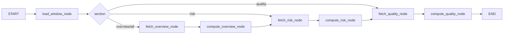
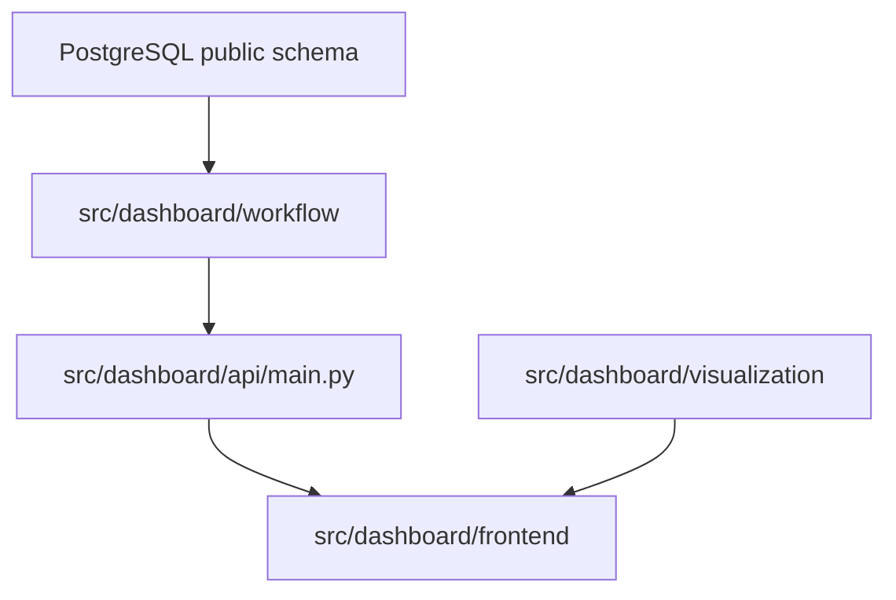

# Dashboard Architecture

운영 대시보드는 `docs/DB/descriptions.md`에 정리된 PostgreSQL `public` 스키마를 읽어 최근 문의, 불만사항, 리스크, 응답 품질을 운영자가 확인할 수 있게 제공한다.

## 목표

- 운영자는 최근 문의량, 대기 backlog, 종료 건수, 당일 접수 건수를 빠르게 확인한다.
- 리스크 담당자는 문의 분석, VOC, 인사이트, 안전성 검사 결과에서 고위험 후보를 추적한다.
- 관리자와 검수자는 답변 초안, 근거 문서, 안전성 점수, 최종 응답과 알림 상태를 함께 확인한다.

## 사용 DB

주요 테이블은 다음과 같다.

| 영역 | 테이블 |
| --- | --- |
| 문의 원천 | `qa_ticket`, `community_users`, `game_accounts` |
| 분석 결과 | `ticket_analysis`, `insight`, `voc_feedback` |
| 답변 생성 | `answer_draft`, `evidence_docs`, `safety_results`, `final_response` |
| 알림/운영 로그 | `notification_logs`, `admin_event_logs`, `failed_queries` |
| 근거 문서 | `documents`, `documents_chunks`, `documents_embeddings` |

최신 분석/초안/응답은 티켓 단위로 `ORDER BY created_at/analyzed_at DESC, id DESC LIMIT 1` 패턴을 사용한다. PostgreSQL에서는 `LEFT JOIN LATERAL`로 구현한다.

## LangGraph 구조

`src/dashboard/workflow`는 operation과 동일하게 `graph.py`, `state.py`, `nodes.py`로 구성한다.

### 노드 역할

| Node | 역할 |
| --- | --- |
| `load_window_node` | `days` 파라미터를 검증하고 `window_start = now - days`를 계산한다. |
| `fetch_overview_node` | 문의 수, 상태/채널/라우팅 분포, 최근 문의 목록을 DB에서 읽는다. |
| `compute_overview_node` | 응답률, 초안 커버리지, 분석 커버리지를 계산한다. |
| `fetch_risk_node` | `ticket_analysis`, `insight`, `safety_results` 기반 리스크 분포와 고위험 후보를 읽는다. |
| `compute_risk_node` | 안전성 평균 점수에 threshold를 적용해 alert flag를 계산한다. |
| `fetch_quality_node` | 초안, 근거, 최종 응답, 알림 상태, 품질 점검 후보를 읽는다. |
| `compute_quality_node` | 초안 티켓률, 근거 첨부율, 최종 응답률을 계산한다. |

## 런타임 구성

| 경로 | 역할 |
| --- | --- |
| `src/dashboard/workflow/state.py` | LangGraph 상태 모델 |
| `src/dashboard/workflow/nodes.py` | DB 조회와 지표 계산 노드 |
| `src/dashboard/workflow/graph.py` | 그래프 선언과 실행 함수 |
| `src/dashboard/visualization/charts.py` | Streamlit 차트용 DataFrame 변환 함수 |
| `src/dashboard/visualization/tables.py` | 표 렌더링용 행 정리 함수 |
| `src/dashboard/api/main.py` | FastAPI endpoint, workflow 호출 |
| `src/dashboard/frontend/app.py` | Streamlit 메인 대시보드 |
| `src/dashboard/frontend/pages/` | 운영 현황, 리스크 분석, 응답 품질 페이지 |
| `src/dashboard/run.py` | API와 Streamlit을 함께 실행 |

## 데이터 흐름

## 구현 원칙

- 수치와 비율은 API/workflow에서 계산하고 Streamlit은 렌더링에 집중한다.
- 날짜 필터는 `qa_ticket.inquiry_created_at >= window_start` 기준이다.
- 최신 값이 필요한 테이블은 티켓 단위 최신 레코드만 사용한다.
- 상세 조회는 `ticket_id` 단위로 문의, 분석, 초안, 근거, 안전성, 최종 응답, 알림, VOC를 한 번에 반환한다.
