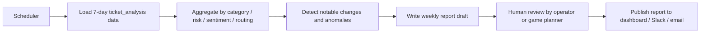

# Ticket Analysis Insight Report Agent

## 1. 목적

이 문서는 `ticket_analysis` 테이블을 중심으로 운영자, 게임기획, 담당자가 함께 활용할 수 있는
인사이트 종합 페이지와 주간 운영상황 보고서 에이전트의 요구사항을 정의한다.

핵심 목표는 다음과 같다.

- 문의 분석 결과를 컬럼 단위로 해석해 운영자가 빠르게 판단할 수 있게 한다.
- 게임기획 담당자가 이슈 유형, 감성, 위험도, 라우팅 패턴을 한 번에 확인할 수 있게 한다.
- 주 1회 자동으로 운영상황 보고서를 생성하는 에이전트를 추가 구축한다.
- `ticket_analysis`의 모든 컬럼을 누락 없이 활용한다.

## 2. 대상 데이터

`docs/DB/descriptions.md` 기준 `ticket_analysis` 컬럼은 다음과 같다.

| Column | Meaning | Page / Report Usage |
| --- | --- | --- |
| `analysis_id` | 분석 레코드 PK | 최신 분석 선택, 이력 추적, 보고서 참조 키 |
| `ticket_id` | 문의 PK FK | 문의 상세 연결, 이슈 재조회, 보고서 그룹핑 |
| `category` | 문의 분류 | 유형별 분포, 기획 이슈 분해, 우선순위 분류 |
| `responder_type` | 응답 대상/유형 | 담당 부서 분배, 운영 책임 구분, 라우팅 품질 점검 |
| `enriched_query` | 확장된 질의문 | 원문 보강 의도 확인, 분류 품질 검토, LLM 분류 근거 확인 |
| `risk_level` | 위험도 | 고위험 문의 탐지, 경고 카드, 주간 위험 추세 |
| `sentiment` | 감성 | 불만 증가 감시, 커뮤니티 분위기 추세, CS 부담 추정 |
| `routing_target` | 처리 라우팅 대상 | human_review / urgent_alert / 자동처리 비율 추적 |
| `summary` | 분석 요약 | 운영자 빠른 스캔, 보고서 서술형 요약, 대표 이슈 묶음 |
| `analyzed_at` | 분석 시각 | 최신성 판단, 주간/일간 집계, 추세 그래프 기준점 |

## 3. 인사이트 페이지 요구사항

### 3.1 페이지 목적

인사이트 페이지는 `ticket_analysis`를 기준으로 운영자와 게임기획 담당자가 다음을 확인하는 화면이다.

- 어떤 문의가 많이 들어왔는지
- 어떤 카테고리가 상승하고 있는지
- 위험도가 높은 문의가 어디로 라우팅되는지
- 감성 악화가 특정 분류나 응답 유형과 연결되는지
- `enriched_query`와 `summary`를 통해 모델/분류 품질이 타당한지

### 3.2 화면 구성

| Section | Description | Uses |
| --- | --- | --- |
| Filter bar | 기간, `category`, `responder_type`, `risk_level`, `sentiment`, `routing_target` 필터 | `ticket_analysis` 전체 |
| KPI row | 총 분석 수, HIGH/critical 수, negative 수, human_review 수, urgent_alert 수 | `analysis_id`, `risk_level`, `sentiment`, `routing_target` |
| Category distribution | 카테고리별 건수 / 비율 | `category` |
| Responder distribution | 응답 대상 유형별 건수 | `responder_type` |
| Risk distribution | 위험도 분포 | `risk_level` |
| Sentiment distribution | 감성 분포 | `sentiment` |
| Routing distribution | 라우팅 대상 분포 | `routing_target` |
| Recency trend | `analyzed_at` 기준 주간/일간 추세 | `analyzed_at` |
| Analysis table | 티켓별 최신 분석 목록 | `analysis_id`, `ticket_id`, `category`, `responder_type`, `risk_level`, `sentiment`, `routing_target`, `summary`, `analyzed_at` |
| Detail drawer | 선택한 분석의 원문 보강과 요약 표시 | `enriched_query`, `summary` |

### 3.3 컬럼별 시각화 방식

| Column | Visualization | Insight |
| --- | --- | --- |
| `analysis_id` | 최신순 정렬, row id | 최신 레코드 판별 |
| `ticket_id` | 상세 링크 | 문의 원문/업무 로그와 연결 |
| `category` | bar chart / pie chart | 어떤 문의가 가장 많이 쌓이는지 |
| `responder_type` | bar chart | 응답 책임이 어느 팀에 몰리는지 |
| `enriched_query` | detail panel, keyword highlight | 분류 입력이 충분히 풍부한지 |
| `risk_level` | stacked bar, badge | 고위험 문의 비중 |
| `sentiment` | trend chart, badge | 감성 악화 여부 |
| `routing_target` | funnel / bar chart | 자동처리 vs human_review vs urgent_alert |
| `summary` | list preview | 운영자 빠른 스캔용 핵심 문장 |
| `analyzed_at` | time series | 최근 7일/30일 추세와 변동점 |

### 3.4 운영자에게 필요한 인사이트 문장 예시

- `risk_level = high`인 문의는 `category = payment`와 결합되어 반복되는지 확인한다.
- `sentiment = negative`가 증가하는 경우, 특정 `responder_type` 또는 `routing_target`에 편중되는지 본다.
- `routing_target = human_review`와 `urgent_alert`의 비율이 높아지면 자동처리 기준을 재검토한다.
- `enriched_query`가 원문 대비 지나치게 짧거나 의미가 누락되면 분류 전처리를 점검한다.
- `summary`가 동일 패턴으로 반복되면 운영 공지 또는 FAQ 반영 후보로 올린다.

## 4. 주간 운영상황 보고서 에이전트

### 4.1 목적

이 에이전트는 1주일에 한 번 자동 실행되어 게임기획 담당자와 운영자가 읽을 수 있는
운영상황 보고서를 생성한다. 보고서는 단순 지표 나열이 아니라,
`ticket_analysis`의 10개 컬럼을 해석한 서술형 인사이트를 포함해야 한다.

### 4.2 실행 주기

- 기본 주기: 매주 1회
- 권장 실행 시각: 월요일 오전 09:00 KST
- 집계 범위: 직전 7일
- 예외: 공휴일 또는 장애 발생 시 수동 재실행 가능

### 4.3 입력 데이터

에이전트는 최소 다음을 사용한다.

- `ticket_analysis` 전체 컬럼
- `qa_ticket`의 문의 원문, 접수 시각, 상태
- `final_response`의 최종 응답 여부와 생성 시각
- `safety_results`의 검증 결과
- `notification_logs`의 발송 실패 여부

`ticket_analysis` 컬럼은 반드시 모두 활용한다.

### 4.4 에이전트 처리 흐름



### 4.5 단계별 책임

| Step | Responsibility |
| --- | --- |
| Load | 최근 7일간 `ticket_analysis`와 연결 테이블을 읽는다. |
| Aggregate | 카테고리, 위험도, 감성, 라우팅, 응답 대상 기준으로 통계를 만든다. |
| Compare | 지난주 대비 증가/감소와 특이 패턴을 비교한다. |
| Explain | `enriched_query`와 `summary`로 왜 그런 분류가 나왔는지 설명한다. |
| Draft | 운영 보고서 초안을 생성한다. |
| Review | 게임기획 또는 운영 담당자가 최종 검토한다. |
| Publish | 대시보드 아카이브, Slack 요약, 이메일 본문으로 배포한다. |

### 4.6 보고서 목차

주간 보고서는 다음 항목을 포함한다.

1. 이번 주 문의 총량과 전주 대비 변화
2. `category`별 주요 증가 항목
3. `risk_level`별 고위험 문의 추세
4. `sentiment` 악화 구간과 원인 후보
5. `routing_target` 분포와 human_review 비율
6. `responder_type` 별 처리 부담
7. `enriched_query` 품질과 분류 해석 이슈
8. `summary` 기반 대표 사례 3건
9. 다음 주 대응 액션

### 4.7 보고서 작성 규칙

- 수치와 서술을 분리한다.
- 각 섹션은 `ticket_analysis` 컬럼을 근거로 작성한다.
- `risk_level`, `sentiment`, `routing_target`는 절대 임의로 재해석하지 않고 원래 값과 비교한다.
- `enriched_query`는 프라이버시를 침해하지 않는 범위에서만 노출한다.
- `summary`는 운영자용 한 줄 요약으로, 게임기획 담당자가 읽어도 이해 가능해야 한다.

### 4.8 결과물 형태

에이전트의 결과물은 다음 3종으로 저장한다.

- 대시보드 보고서 카드
- Slack/Discord용 짧은 요약
- 이메일 또는 문서 아카이브용 전체 보고서

## 5. 구현 가이드

### 5.1 추천 구조

- `src/dashboard/agents/weekly_report/`
- `src/dashboard/agents/weekly_report/graph.py`
- `src/dashboard/agents/weekly_report/nodes.py`
- `src/dashboard/agents/weekly_report/prompts.py`
- `src/dashboard/agents/weekly_report/scheduler.py`

### 5.2 체인 선택

- 데이터 집계와 계산은 LCEL 또는 순수 함수로 처리한다.
- 주간 보고서의 흐름 제어와 재시도, human review 분기는 LangGraph로 관리한다.
- 반복되는 템플릿 생성은 prompt + structured output으로 고정한다.

### 5.3 추천 산출물 예시

```text
[주간 운영상황 보고서]
- 이번 주 분석 건수: 1,248
- HIGH/critical 문의: 42
- negative sentiment 증가 카테고리: payment, refund
- human_review 비중: 18.7%
- urgent_alert 비중: 2.1%
- 주요 원인: `enriched_query`가 짧은 문의에서 risk 분류가 불안정
- 권고: payment 카테고리 FAQ 보강, human_review 기준 일부 완화 검토
```

## 6. 성공 기준

- `ticket_analysis`의 10개 컬럼이 모두 페이지 혹은 보고서에서 실제로 쓰인다.
- 운영자는 고위험 문의와 라우팅 분포를 빠르게 파악할 수 있다.
- 게임기획 담당자는 `category`, `sentiment`, `summary`, `enriched_query`를 통해 정책 개선 후보를 찾을 수 있다.
- 주간 보고서는 지난 7일의 운영 상태를 반복 가능한 형식으로 자동 생성한다.
- 사람이 최종 검토해도 바로 배포 가능한 수준의 초안이 나온다.

## 7. 권장 후속 작업

1. 이 문서를 기준으로 `src/dashboard`에 주간 보고서 에이전트 모듈을 추가한다.
2. `ticket_analysis` 기반 집계 API를 별도 endpoint로 분리한다.
3. 대시보드 화면에 "주간 보고서" 탭을 추가한다.
4. 주간 보고서 결과를 `admin_event_logs` 또는 별도 아카이브 테이블에 저장한다.
