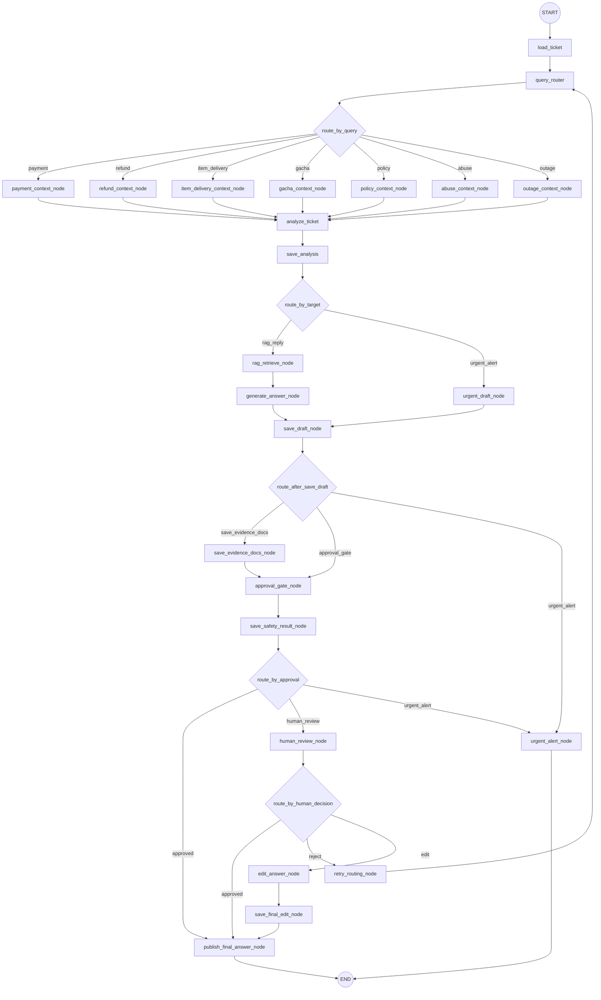

# Operation Workflow 분석

## 1. 상태 모델

`OperationState`는 모든 노드가 공유하는 단일 상태 객체입니다.

| 필드 | 의미 |
| --- | --- |
| `ticket_id` | 워크플로우 입력 티켓 ID |
| `ticket` | `qa_ticket`, `community_users`, `game_accounts` 조인 결과 |
| `query_text` | LLM 분류와 RAG 검색에 사용하는 문의 본문 |
| `query_route` | 문의 유형: `payment`, `refund`, `item_delivery`, `gacha`, `policy`, `abuse`, `outage` |
| `target_route` | 답변 생성 또는 긴급 알림 분기: `rag_reply`, `urgent_alert` |
| `approval_route` | 안전성 검수 후 분기: `approved`, `human_review`, `urgent_alert` |
| `context` | 유형별 DB 컨텍스트 |
| `analysis` | 위험도, 요약, 필요 조치, 목표 route |
| `retrieved_docs` | RAG 검색으로 가져온 근거 문서 청크 |
| `answer_draft` | 고객 답변 초안 |
| `urgent_draft` | 운영자 긴급 알림 초안 |
| `safety_result` | 환각/정책 위반/위험 표현/근거 일치 검수 결과 |
| `human_review` | 사람 검수 결정 보조 결과 |
| `analysis_id`, `draft_id`, `safety_id`, `response_id` | 각 저장 테이블의 PK |

## 2. 그래프 구조

`build_operation_graph()`는 `StateGraph(OperationState)`에 `nodes.NODE_FUNCTIONS`를 등록하고 조건부 엣지를 연결합니다.

## 3. 노드별 책임

| 노드 | 입력 | 처리 | 출력/저장 |
| --- | --- | --- | --- |
| `load_ticket` | `ticket_id` | 티켓, 사용자, 게임 계정 메타데이터 조회 | `ticket`, `query_text`, `status` |
| `query_router` | 문의 상태 JSON | LLM으로 문의 유형 분류 | `query_route`, `query_route_reason` |
| `{route}_context_node` | `query_route`, 티켓 메타데이터 | 유형별 업무 테이블 조회 | `context[route]`, `context_nodes` |
| `analyze_ticket` | 티켓 + 컨텍스트 | LLM으로 위험도/목표 route 분석 | `analysis`, `target_route` |
| `save_analysis` | 분석 결과 | `ticket_analysis` 저장 | `analysis_id` |
| `rag_retrieve_node` | `query_text` | `documents_chunks` 전문검색/ILIKE 검색 | `retrieved_docs`, `evidence_doc_ids` |
| `generate_answer_node` | 상태 + 근거 | LLM 답변 초안 생성 | `answer_draft`, `evidence_doc_ids` |
| `urgent_draft_node` | 상태 + 분석 | LLM 긴급 알림 초안 생성 | `urgent_draft`, `answer_draft` |
| `save_draft_node` | `analysis_id`, 초안 | `answer_draft` 저장 | `draft_id` |
| `save_evidence_docs_node` | `draft_id`, 근거 문서 | `evidence_docs` 저장 | `status=evidence_saved` |
| `approval_gate_node` | 초안 + 근거 | LLM 안전성 검수 | `safety_result`, `approval_route` |
| `save_safety_result_node` | 안전성 결과 | `safety_results` 저장 | `safety_id` |
| `publish_final_answer_node` | 승인/수정 답변 | `final_response` 저장, 티켓 종료 | `final_answer`, `response_id`, `status=closed` |
| `human_review_node` | 안전성 미승인 상태 | LLM이 검수 권고안 생성 | `human_decision`, `human_review`, `edited_answer` |
| `retry_routing_node` | 반려 결정 | 초안/승인 상태 초기화, 재시도 횟수 증가 | `retry_count`, `metadata.retry_reason` |
| `edit_answer_node` | 수정 결정 | 검수 수정안을 최종 답변 후보로 반영 | `edited_answer` |
| `save_final_edit_node` | 수정 답변 | 상태에 최종 답변 확정 | `final_answer` |
| `urgent_alert_node` | 긴급 초안 | `notification_logs` 저장 | `notification_id`, `status=urgent_alert_pending` |

## 4. 라우팅 규칙

`route_by_query`

- `query_router`가 반환한 `query_route`를 기준으로 업무 컨텍스트 노드를 선택합니다.
- 필수 값이 없으면 `ValueError`를 발생시켜 그래프 실행을 중단합니다.

`route_by_target`

- `target_route=rag_reply`이면 RAG 기반 답변 생성으로 이동합니다.
- `target_route=urgent_alert`이면 운영자 알림 초안을 만들고 안전성 검수 없이 알림 저장으로 이동합니다.

`route_after_save_draft`

- 긴급 route이면 `urgent_alert_node`로 이동합니다.
- 검색 근거가 있으면 `save_evidence_docs_node`를 거쳐 안전성 검수로 이동합니다.
- 검색 근거가 없으면 바로 `approval_gate_node`로 이동합니다.

`route_by_approval`

- 정책 위반 또는 `critical` 위험도는 긴급 알림으로 보냅니다.
- 안전성 검수 승인 시 최종 답변을 발행합니다.
- 승인 실패 시 사람 검수 흐름으로 보냅니다.

`route_by_human_decision`

- `approved`: 최종 발행
- `reject`: 라우팅부터 재시도
- `edit`: 수정 답변 저장 후 최종 발행

## 5. DB 입출력

조회 테이블:

- `qa_ticket`, `community_users`, `game_accounts`
- `payments`, `refunds`, `item_delivery_logs`, `gacha_logs`
- `insight`, `voc_feedback`
- `documents`, `documents_chunks`

저장 테이블:

- `ticket_analysis`
- `answer_draft`
- `evidence_docs`
- `safety_results`
- `final_response`
- `notification_logs`

검수 API 로그:

- `admin_event_logs`

## 6. 로깅

모든 노드는 `_with_node_logging()` 래퍼로 감싸져 실행 시작, 성공, 실패, 소요 시간을 `logs/operation/workflow.log`에 기록합니다. 로그는 티켓 ID, 라우팅 값, 주요 저장 PK, 상태값 중심으로 남기며 본문 전체를 직접 남기지 않는 방향입니다.

## 7. 테스트 커버리지

`test_workflow_unit.py`

- 티켓 로딩 매핑
- 컨텍스트 노드 병합
- LLM 노드 상태 업데이트
- 라우터 필수 값 검증
- 초안 저장 후 분기 규칙

`test_workflow_full.py`

- 일반 승인 경로에서 `ticket_analysis`, `answer_draft`, `evidence_docs`, `safety_results`, `final_response` 저장
- 긴급 경로에서 `notification_logs` 저장 및 최종 답변 미발행
- 동시 실행 안정성을 위해 `SELECT MAX(id)` 대신 `RETURNING` 사용 확인

`test_operation_workflow_graph_image.py`

- LangGraph 구조를 PNG로 저장할 수 있는지 확인
