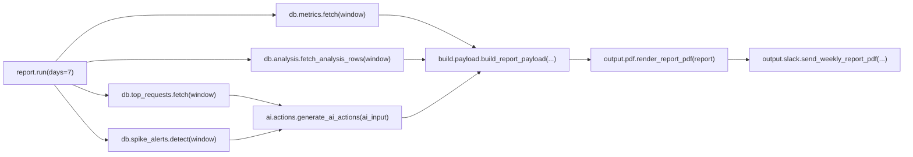

# Weekly Report Architecture

## 목적

현재 `apps/weekly_report`는 별도 대시보드가 아니라, 주간 운영 리포트를 생성해 PDF로 렌더링하고 필요하면 Slack으로 전송하는 배치/수동 실행 모듈이다.

이 문서는 **현재 구현된 코드 기준**의 구성과 데이터 흐름만 설명한다.

## 현재 엔트리포인트

| 경로 | 역할 |
| --- | --- |
| `apps/weekly_report/report.py` | 전체 오케스트레이션 진입점 |
| `apps/weekly_report/api/main.py` | `GET /health`, `POST /report/trigger` 제공 |
| `apps/weekly_report/airflow/weekly_report_dag.py` | 매주 월요일 09:00 KST 실행 DAG |

## 내부 모듈

| 경로 | 역할 |
| --- | --- |
| `apps/weekly_report/db/analysis.py` | `ticket_analysis` 중심 분석 행 조회 |
| `apps/weekly_report/db/metrics.py` | KPI/카테고리 집계 조회 |
| `apps/weekly_report/db/top_requests.py` | Top 5 개선 요청 계산 |
| `apps/weekly_report/db/spike_alerts.py` | 시간대/요일/주간 추세 이상 감지 |
| `apps/weekly_report/ai/actions.py` | 주간 권장 액션 생성 |
| `apps/weekly_report/ai/row_interpret.py` | 검토용 행별 해석 생성 |
| `apps/weekly_report/build/payload.py` | 최종 리포트 payload 조립 |
| `apps/weekly_report/output/pdf.py` | PDF 렌더링 |
| `apps/weekly_report/output/slack.py` | Slack 업로드 |

## 실행 흐름

## 현재 읽는 테이블

| 테이블 | 사용 위치 | 용도 |
| --- | --- | --- |
| `qa_ticket` | `metrics.py`, `analysis.py`, `top_requests.py`, `spike_alerts.py` | 기간 기준 티켓 집계의 기준 테이블 |
| `ticket_analysis` | `metrics.py`, `analysis.py`, `top_requests.py` | 카테고리, 리스크, 감성, 라우팅 정보 |
| `insight` | `analysis.py` | 티켓별 최신 insight 1건 조인 |
| `community_users` | `analysis.py` | 닉네임 표시 |
| `answer_draft` | `metrics.py` | 초안 수/초안 커버리지 집계 |
| `final_response` | `metrics.py` | 응답 완료율 집계 |
| `safety_results` | `metrics.py` | safety check 수 집계 |
| `voc_feedback` | `top_requests.py` | `topic_keywords` 보조 조회 |

## `voc_feedback` 주의사항

- 현재 `top_requests.py`는 `voc_feedback.topic_keywords`를 읽으려 시도한다.
- 하지만 라이브 스키마 문서(`docs/DB/descriptions.md`, 생성일 2026-06-18)에는 `voc_feedback` 테이블이 없다.
- 구현은 이 조회가 실패해도 `topic_keywords=[]`로 계속 진행하도록 예외를 흡수한다.
- 따라서 현재 배치의 필수 테이블은 아니지만, 키워드 품질에는 영향을 준다.

## 현재 생성 산출물

`report.run()` 반환값:

- `report`: PDF/Slack 렌더러가 소비하는 최종 payload
- `pdf_bytes`: PDF 렌더링 결과
- `slack_result`: Slack 전송 결과 또는 `None`

## 현재 API 범위

`apps/weekly_report/api/main.py`에 구현된 엔드포인트는 아래 둘뿐이다.

- `GET /health`
- `POST /report/trigger`

과거 문서에 있던 `/summary/*`, `/tickets`, `/tickets/{ticket_id}` 같은 대시보드 API는 현재 `apps/weekly_report`에 존재하지 않는다.

## 현재 Airflow 범위

`apps/weekly_report/airflow/weekly_report_dag.py`의 DAG ID는 `dashboard_weekly_report`이고, 기본 스케줄은 `0 9 * * 1`이다.

실행 태스크는 단일 태스크 `run_weekly_report`이며, 내부에서 `report.run(days=7, render_pdf=True, send_to_slack=True, ...)`를 호출한다.
